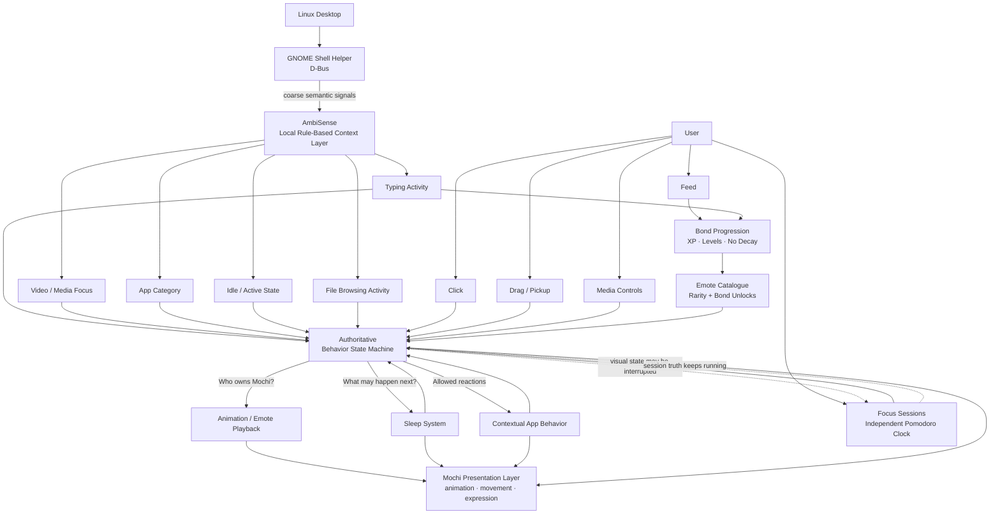

# I Built a Better Codex Pet Than OpenAI Did

> [!info] 一句话导读
> 

> [!meta]- 语料信息（点开展开）
> 来源：dev.to（post）
> 原帖：<https://dev.to/mikachu/i-built-a-better-codex-pet-than-openai-did-eib>
> 指标：reactions=31 · 评论=7 · reading_time=5
> 作者：Mika Flowers　|　发布：2026-09-26T11:16:56Z
> 项目链接：<https://github.com/miflow13/mochi-desktop>
> 采集：2026-09-28T09:50:07+08:00　|　id：`7a120cdb79ba4465`

## 正文

*Sometimes you just have to let the agent cook.*

## *Mika vs. a multi-billion-dollar corporation, and a stupid little desktop pet.*

When OpenAI shipped Codex Pets in May 2026, they wanted to give your coding agent a face. The pets float as an overlay on Windows and macOS, showing real-time status updates about what Codex is doing, and can notify users when a task completes or when the agent needs input. The feature launched with eight built-in pets and a way to generate custom, AI-animated pets from user images.

Before I go further, a caveat: this isn't really a fair fight. Codex Pets is a small feature bolted onto a coding agent used by millions of people, built by a team with the resources to ship across two operating systems on day one. Mochi is a solo, Linux-only alpha. They're not competing for the same thing, and if you're after "which is the more polished, widely-used product," Codex Pets wins that easily. What they *do* share is one idea — a little creature that lives on your screen — and this is a look at what happens when you take that same idea and refuse to stop at "cute status light."

It's a clever idea. It's also, underneath the cute art, kind of nothing. Strip away the sprite and a Codex Pet is a status light with a tail — a red clock when it's waiting on you, a green check when it's done. Cute, sure. Impressive, not really. So I built the version I actually wanted: [Mochi](https://github.com/miflow13/mochi-desktop), an open-source Linux desktop companion with a real state machine, real memory, and a real reason to exist beyond one app's notification stream.

## What Codex Pets actually are

Functionally, a Codex Pet is tied to one thing: the state of a Codex agent thread. It's a pixel-art animated companion that floats over the desktop while Codex codes, reacting to mouse interaction and Codex status — scratching its head when thinking, popping a speech bubble when a task completes. Custom pets are just a manifest file plus a spritesheet, dropped into a folder. There's no persistent internal state beyond "what is the agent doing right now," no memory between sessions, and no behavior that isn't ultimately a reflection of Codex's own status.

To be fair, that's the correct amount of engineering for the job. A glanceable agent-status widget doesn't need a state machine. It needs to be cute, legible at a glance, and easy for a community to remix. OpenAI nailed that brief. But it *is* just a brief, and a narrow one — the pet doesn't outlive the thread it's watching.

## What Mochi is instead

Mochi doesn't report on anything external. It's not a status light for some other tool — it's meant to feel like it lives on your desktop, full stop, independent of whatever app you happen to have open. That's a different, harder problem, and it shows in the architecture.

Under the hood, Mochi runs on a single authoritative behavior-state machine that mediates between dozens of competing systems — clicking, dragging, sleep, typing detection, media playback, contextual app awareness, and more — all of which have to agree on one question at any given moment: what does Mochi currently own, and what's it allowed to do next? That's before you even get to the systems a Codex Pet has no equivalent for at all:

- **AmbiSense** — a local, rule-based ambient-awareness layer that reduces desktop activity (typing, video playback, file browsing, active app) into privacy-safe semantic signals. Not an LLM, not a cloud service, and built to never see actual keystrokes, file names, or window titles.
- **Bond progression** — a slow, deliberately non-punitive relationship system. No streaks, no decay, no penalty for missing a day. XP accrues from typing time and feeding, and leveling up triggers its own presentation sequence.
- **Focus sessions** — a full Pomodoro-style domain model with its own clock that keeps running even when the visual gets interrupted by a drag or a click. What Mochi looks like and what's actually true in the background are deliberately different questions.
- **An Emote Catalogue** with bond-gated unlocks and rarity tiers, so what Mochi can do actually grows the longer you've had it.
- **A GNOME Shell helper** that taps into real desktop context — typing pulses, idle/active state, app category, video focus — over D-Bus, again reduced to coarse semantic signals rather than raw data.

> Mochi’s architecture separates what is true from what is currently visible. Desktop context, user interaction, progression, focus state, and autonomous behavior all converge on a single behavior-state machine that decides who currently “owns” Mochi and which transitions are legal.

None of that is decoration. Most of Mochi's codebase manual is about lifecycle and ownership: making sure a stale animation callback can't fire after a feature's been interrupted, that a context menu closing visually doesn't leave an invisible input grab behind, that recovery always reevaluates the *current* live context instead of blindly replaying whatever was happening before something interrupted it. That's the kind of problem you only run into once a system has enough moving parts to actually collide with itself — which is exactly the problem a Codex Pet is small enough to never have.

## The real difference

Here's the honest version, not just the flex: a Codex Pet is *supposed* to be thin. It's a feature bolted onto a coding agent, meant to be authored in minutes and understood in one glance. Giving it Mochi's architecture would be overkill for what it's for.

But that's also exactly the point. OpenAI built a mascot for their product. I built a product whose whole job is *being* the mascot — one with persistence, context-awareness, care mechanics that don't depend on any single app, and a state machine robust enough to survive being dragged around, interrupted, and left alone for a week. Codex Pets are a nice feature riding on the back of a multi-billion-dollar coding agent. Mochi is the thing itself, built by one person who wanted the version that actually commits to the bit.

I know which one I'd rather maintain.

---

*Codex Pets details in this post are drawn from public reporting and documentation, not insider access. Mochi is open-source — [browse the code, file an issue, or just come say hi to the little guy](https://github.com/miflow13/mochi-desktop).*

## 评论（7/7）

> **DaC** · 2026-09-26T11:34:19Z　
> Really nice idea, though I noticed a few issues... I'm getting to work🤗

---

> **Mika Flowers** · 2026-09-26T11:38:15Z　
> Ooooh 👀 I’d love that! Feel free to open an issue for anything you find, and PRs are absolutely welcome. If you run into anything confusing in the codebase, just ping me <3

---

> **Paulo Henrique** · 2026-09-26T13:31:00Z　
> I really love this idea, wondering if I'm able to create a macOS version

---

> **Mika Flowers** · 2026-09-26T13:33:17Z　
> I would genuinely love you forever for helping port it to macOS 😂💜 I don’t have a proper macOS test environment right now, so having someone who can actually build and test it there would be amazing. Please feel free to open an issue or PR, and ping me if anything in the codebase is confusing!

---

> **Sina Rezaei** · 2026-09-26T17:43:47Z　
> I think there is an important distinction here: a feature and a product don't have to solve the same problem at the same depth.
>
> Something that is a small feature inside a larger product can be intentionally simple. But when someone turns that idea into the product itself, the architecture, state management and user experience naturally become much deeper.
>
> So “better” isn't always about implementing more. Sometimes it's about having a different scope and being able to optimize the entire system around one specific purpose.

---

> **Sina Rezaei** · 2026-09-26T17:44:08Z　
> The interesting part for me isn't actually the pet animation. It's the state management behind it. Users see a character reacting on screen, but the real engineering problem is deciding what state the system is in, what can trigger a transition, and what should happen when events interrupt each other. The visual layer gets attention. The state machine is where the product logic actually lives.

---

> **Sameer Qaiser** · 2026-09-27T09:07:23Z　
> The line that hit me: "Mochi is the thing itself, built by one person who wanted the version that actually commits to the bit."
>
> I'm a beginner — two weeks into Python, writing tutorials about it on Dev.to. I don't have a state machine or an AmbiSense layer or a GNOME Shell helper. My project is 14 articles and a pitch tracker.
>
> But I recognized the energy immediately. You looked at something that already existed, said "this is fine but it's not what I actually want," and built the version you wanted to exist. Not because it was a market opportunity. Because you wanted it.
>
> The detail that stood out: "Most of Mochi's codebase manual is about lifecycle and ownership — making sure a stale animation callback can't fire after a feature's been interrupted." That's not a mascot problem. That's a systems problem. And you got there because you refused to stop at "cute status light."
>
> I don't know if I'll ever build something with this level of architecture. But I do know the instinct — refusing to stop at the shallow version — is the thing I'm trying to build in my own work. Whether it's a tutorial that explains the why instead of just the how, or a pitch that shows the finished article instead of just promising it.
>
> "Commit to the bit" is going on my wall.
>
> Cool project. Mochi looks great.

## 关联链接

- https://dev-to-uploads.s3.us-east-2.amazonaws.com/uploads/articles/9pnrc10v6twg4yki6bkt.png
- https://dev-to-uploads.s3.us-east-2.amazonaws.com/uploads/articles/rvf5y6qvsz67u9dnsszg.gif
- https://dev-to-uploads.s3.us-east-2.amazonaws.com/uploads/articles/whgo5ur7caewqnsmeap2.png

## 导航

- 项目页：[[10-项目/github.com_0ce23ee4]]
- 渠道页：[[50-渠道/devto]]
- 赛道：`AI 工具/Agent`（见 [[浏览]] 的「按赛道」视图）
- 同渠道/同赛道批量浏览：[[浏览]]
