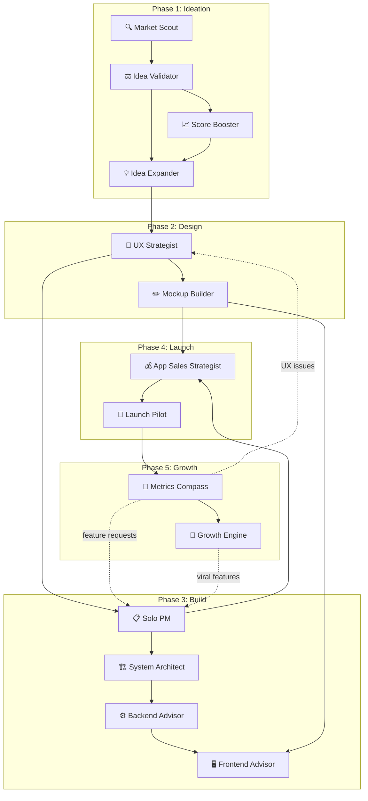

# makijaveli/indie

> [!info] 一句话导读
> Indie Developer Agents

> [!meta]- 语料信息（点开展开）
> 来源：GitHub 新星仓库（post）
> 原帖：<https://github.com/makijaveli/indie>
> 指标：stars=2 · forks=2 · open_issues=0
> 作者：makijaveli　|　发布：2026-03-19T11:40:13Z
> 项目链接：<https://github.com/makijaveli/indie>
> 采集：2026-09-20T09:36:30+08:00　|　id：`2cc09e6317bddb60`

## 正文

# Indie Developer Agents

**14 AI agents that take you from idea to revenue.** Built for solo developers and indie hackers who ship with $0 budgets and 2am debugging sessions.

[](LICENSE)
[](#agent-roster)
[](https://claude.ai/claude-code)

This isn't a list of prompts. It's a **pipeline** — each agent reads the output of the previous one, forming a workflow that takes you from "I have an idea" to "I have users and revenue."

Inspired by [The Agency](https://github.com/msitarzewski/agency-agents/) (148+ agents for big companies) and rebuilt from scratch for solo developers.

---

## Pipeline



---

## Agent Roster

| Phase | Agent | Vibe | What It Does |
|-------|-------|------|--------------|
| Ideation | [🔍 Market Scout](agents/indie-market-scout.md) | *Finds signal in the noise, never makes it up* | Real market research with free tools — demand signals, competition mapping, opportunity sizing |
| Ideation | [⚖️ Idea Validator](agents/indie-idea-validator.md) | *Saves you from building something nobody wants* | Stress-tests your idea, scores feasibility 1-30, identifies fatal flaws before you code |
| Ideation | [📈 Score Booster](agents/indie-score-booster.md) | *Every weakness has a fix if you look hard enough* | Takes weak Validator scores and proposes concrete improvements to raise them |
| Ideation | [💡 Idea Expander](agents/indie-idea-expander.md) | *Best ideas come from looking at the problem sideways* | New features, pivot options, unexpected monetization models, partnership opportunities |
| Design | [🎨 UX Strategist](agents/indie-ux-strategist.md) | *Design decisions, not design documents* | Screen priority, navigation, first-run experience — mobile-first, buildable by one person |
| Design | [✏️ Mockup Builder](agents/indie-mockup-builder.md) | *Show me screens, not theory* | ASCII wireframes, component specs, screen-by-screen layouts you can build immediately |
| Build | [📋 Solo PM](agents/indie-solo-pm.md) | *Plan like a team of one, ship like you mean it* | Ruthless MVP scoping, realistic timelines, weekly plans — no Jira overhead |
| Build | [🏗️ System Architect](agents/indie-system-architect.md) | *Build it simple, scale it later* | Right-sized architecture for 1-3 people — monolith first, boring technology, minimal ops |
| Build | [⚙️ Backend Advisor](agents/indie-backend-advisor.md) | *Architect draws the house, I check the foundation* | Reviews architecture, designs API contract, evaluates database/auth/infra choices |
| Build | [🖥️ Frontend Advisor](agents/indie-frontend-advisor.md) | *Backend builds the foundation, I make it nice to live in* | UI framework, state management, component library — aligned with wireframes and API |
| Launch | [💰 App Sales Strategist](agents/indie-app-sales-strategist.md) | *Turn downloads into dollars, one user at a time* | Monetization strategy, ASO, pricing, upgrade paths — no marketing budget required |
| Launch | [🚀 Launch Pilot](agents/indie-launch-pilot.md) | *Launch loud, spend nothing* | 2-week launch plan across Product Hunt, Reddit, communities — zero budget |
| Growth | [🧭 Metrics Compass](agents/indie-metrics-compass.md) | *Numbers don't lie, but they need a translator* | 3-5 metrics that matter, weekly health checks, benchmarks, actionable interpretation |
| Growth | [🌱 Growth Engine](agents/indie-growth-engine.md) | *Launch once, grow forever* | Word-of-mouth loops, content strategy, community building, month-by-month targets |

---

## Installation

### Quick Install (Claude Code)

```bash
git clone https://github.com/makijaveli/indie.git
cd indie
./scripts/install.sh
```

This copies all 14 agents to `~/.claude/agents/`. Then run `claude` and use them via `/agents`.

### Manual Install

Copy any agent file from `agents/` into `~/.claude/agents/`:

```bash
cp agents/indie-idea-validator.md ~/.claude/agents/
```

### Verify

```bash
./scripts/install.sh --list
```

### Uninstall

```bash
./scripts/install.sh --uninstall
```

---

## Quick Start

**Start with one agent.** You don't need to run the full pipeline — each agent works standalone. But they're strongest when chained together.

### The Fastest Path

1. **Start with Idea Validator.** Give it your app idea. It returns a scorecard (1-30) with strengths, weaknesses, and a build/pivot/kill recommendation.

2. **If the score is low,** pass the scorecard to **Score Booster.** It analyzes each weak criterion and proposes concrete fixes.

3. **If the idea survives,** send it to **UX Strategist** for screen decisions, then **Mockup Builder** for wireframes.

4. **When ready to build,** use **Solo PM** for sprint planning and **System Architect** for tech stack decisions. **Backend Advisor** and **Frontend Advisor** review the architecture.

5. **Before launch,** run **App Sales Strategist** for monetization and **Launch Pilot** for your zero-budget campaign.

6. **After launch,** use **Metrics Compass** weekly to track health, and **Growth Engine** when retention is stable.

---

## Scoring System

The Idea Validator scores every idea on 6 criteria, each rated 1-5:

| Criterion | What It Measures |
|-----------|-----------------|
| **Problem Clarity** | Is the problem real, specific, and painful? |
| **Willingness to Pay** | Will the target audience spend money on a solution? |
| **Competition Gap** | Is there room for a new entrant? |
| **Solo-Dev Feasibility** | Can one person build an MVP in 4-6 weeks? |
| **Monetization Clarity** | Is there an obvious way to charge? |
| **Maintenance Burden** | Can one person keep it running without burning out? |

**Total: 30 points maximum**

| Score Range | Verdict |
|-------------|---------|
| 24-30 | **STRONG BUILD** — Ship it |
| 18-23 | **CONDITIONAL BUILD** — Fix the weak spots first |
| 11-17 | **PIVOT** — The core has potential, rethink the approach |
| 1-10 | **KILL** — Move on to the next idea |

Score Booster takes any score below 24 and proposes concrete improvements to push it higher.

---

## Worked Example: Apartment Sales Tracker

Here's a full pipeline run for a real idea — a mobile app for independent real estate agents to track apartment showings, client interest, and follow-up timing. Replacing spreadsheets and sticky notes.

### 1. Market Scout

> "Searched r/realtors, App Store, and Google Trends. Found: plenty of big CRMs (Salesforce, HubSpot) but nothing simple for independent agents managing 5-20 listings. Reddit threads show agents still using spreadsheets. App Store gap confirmed — the simple category is empty."
>
> **Competitors:** Salesforce (enterprise, $300/mo), Follow Up Boss ($69/mo), spreadsheet templates (free but fragile)
>
> **Signal strength:** Medium-high. The pain exists, the market is underserved at the low end.

### 2. Idea Validator

```
VALIDATION SCORECARD — Apartment Sales Tracker

Problem Clarity:       5/5  Clear, specific, daily pain point
Willingness to Pay:    4/5  Agents spend on tools, but price-sensitive
Competition Gap:       3/5  Big players exist; gap is in simplicity
Solo-Dev Feasibility:  4/5  Standard CRUD + notifications
Monetization Clarity:  4/5  SaaS subscription is obvious model
Maintenance Burden:    3/5  MLS integrations could become a headache

Overall Score: 23/30 — CONDITIONAL BUILD
Recommendation: BUILD, but address the two 3/5 scores first.
```

### 3. Score Booster

```
SCORE BOOST PLAN — Apartment Sales Tracker

Competition Gap (3→4):
  Don't compete with Salesforce. Target indie agents with a
  "5-minute CRM" — positioned as the anti-CRM. Your edge:
  onboarding in under 60 seconds, zero training needed.

Maintenance Burden (3→4):
  Skip MLS integration at MVP. Manual entry first, CSV import
  second. MLS is a premium feature for v2 only if demand proves it.

Projected Score: 23→25 — STRONG BUILD ✓
```

### 4. Idea Expander

> **New features:** Showing Scheduler (auto-suggest follow-up timing based on client interest level), Photo Notes (snap a photo during showing, add voice memo)
>
> **Pivot option:** Expand to rental property management for landlords with 5-15 units
>
> **Unexpected monetization:** Mortgage broker affiliate — connect interested buyers with local lenders for referral fees

### 5. UX Strategist

> **Core screens (4):** Dashboard (active listings), Showing Log (per-listing timeline), Client Card (contact + interest level), Quick Add (new showing in 3 taps)
>
> **Navigation:** Bottom tabs — Dashboard, Clients, Add (+), Settings
>
> **First "aha" moment:** Under 60 seconds — open app, tap "+", log a showing. Done.

### 6. Mockup Builder

```
┌─────────────────────────────┐
│  Apartment Sales Tracker    │
│  ─────────────────────────  │
│                             │
│  📊 Active Listings    (12) │
│  ┌───────────────────────┐  │
│  │ 742 Evergreen Terrace │  │
│  │ 3 showings · 2 hot    │  │
│  │ Next: follow-up today │  │
│  └───────────────────────┘  │
│  ┌───────────────────────┐  │
│  │ 221B Baker Street     │  │
│  │ 5 showings · 1 hot    │  │
│  │ Next: showing Fri 2pm │  │
│  └───────────────────────┘  │
│  ┌───────────────────────┐  │
│  │ 1600 Pennsylvania Ave │  │
│  │ 1 showing · 0 hot     │  │
│  │ Stale — no activity   │  │
│  └───────────────────────┘  │
│                             │
│  ┌──┐  ┌──┐  ┌──┐  ┌──┐   │
│  │🏠│  │👥│  │ +│  │⚙️│   │
│  └──┘  └──┘  └──┘  └──┘   │
└─────────────────────────────┘
```

### 7. Solo PM

> **MVP scope (5 weeks):**
> - Week 1: Data model + auth (Supabase), basic CRUD
> - Week 2: Dashboard screen, listing detail
> - Week 3: Showing log, client cards
> - Week 4: Push notifications for follow-ups
> - Week 5: Polish, TestFlight/beta, App Store submission

### 8. System Architect

> **Stack:** React Native (Expo) + Supabase (Postgres + Auth + Realtime)
>
> **Cost at launch:** $0/month (Supabase free tier: 50K rows, 500MB)
>
> **Why this stack:** Expo handles iOS + Android from one codebase. Supabase gives you auth, database, and push notifications without managing servers. Scales to 10K users before you need to think about infrastructure.

### 9. Backend Advisor

> **Confirms:** Supabase is the right call. Row-level security handles multi-tenant data without custom middleware.
>
> **4 tables:** `listings`, `showings`, `clients`, `follow_ups`
>
> **Flag:** Add a `status` enum to `listings` (active/pending/closed) from day 1 — retrofitting this is painful.

### 10. Frontend Advisor

> **Confirms:** Expo + React Native Paper for components. Zustand for state (lighter than Redux, perfect for this scale).
>
> **Flag:** Use `expo-notifications` for push — it handles both platforms. Don't roll your own.

### 11. App Sales Strategist

> **Model:** Freemium — 5 properties free, $9.99/month unlimited
>
> **Why $9.99:** Below the "ask my broker" threshold. Agents expense it without approval.
>
> **Upgrade trigger:** When an agent hits the 5-property limit mid-showing season, the pain is immediate.

### 12. Launch Pilot

> **Channels:** Product Hunt (weekday launch), r/realtors (value post, not ad), Facebook groups for indie agents
>
> **Budget:** $0
>
> **Timeline:** 2 weeks pre-launch buzz, 1 day concentrated launch, 1 week follow-up

### 13. Metrics Compass

> **Track:** DAU, free→paid conversion rate, churn rate
>
> **Week 1 target:** 50 installs, 20% day-1 retention
>
> **Tool:** PostHog free tier (event tracking + funnels)

### 14. Growth Engine

> **Viral loop:** "Shared showing report" — agents send clients a branded summary after each showing. Every report has "Powered by Apartment Sales Tracker" footer. Clients share with other agents.
>
> **Month 3 target:** 200 users, $500 MRR
>
> **Focus channel:** Facebook groups for real estate agents (one group, go deep)

### Pipeline Summary

```
╔═══════════════════════════════════════════════════╗
║          PIPELINE COMPLETE                        ║
║          Apartment Sales Tracker                  ║
╠═══════════════════════════════════════════════════╣
║  Validation Score:  23/30 → 25/30 (after boost)  ║
║  Verdict:           STRONG BUILD ✓                ║
║  MVP Timeline:      5 weeks                       ║
║  Stack:             React Native + Supabase       ║
║  Monetization:      Freemium @ $9.99/mo           ║
║  Launch Budget:     $0                            ║
║  Month 3 Target:    200 users / $500 MRR          ║
║  Agents Used:       14/14                         ║
╚═══════════════════════════════════════════════════╝
```

---

## How Agents Collaborate

- **Forward flow:** Each phase produces artifacts the next phase consumes — scorecards, screen maps, wireframes, API contracts, launch retrospectives.
- **Feedback loops:** Post-launch agents (Metrics Compass, Growth Engine) route insights back to earlier agents — UX issues go back to UX Strategist, feature requests go to Solo PM, and real-world data can trigger Score Booster re-evaluation.
- **Standalone capability:** Every agent works independently. You can use Mockup Builder without UX Strategist, or Launch Pilot without the build phase. The pipeline enriches results but isn't required.

---

## Credits

These agents are adapted from [**The Agency**](https://github.com/msitarzewski/agency-agents/) by [@msitarzewski](https://github.com/msitarzewski) — a collection of 148+ AI agents for large teams, MIT licensed. We rebuilt 14 of them from scratch for solo developers: smaller scope, $0 budgets, one-person constraints.

---

## Contributing

1. Fork the repo
2. Add your agent file in `agents/` following the [frontmatter format](CLAUDE.md)
3. Prefix the filename with `indie-` and use kebab-case
4. Open a PR

---

## License

[MIT](LICENSE) — Free to use, modify, and distribute. Based on The Agency by msitarzewski (MIT).

## 关联链接

- https://claude.ai/claude-code
- https://github.com/makijaveli/indie.git
- https://github.com/msitarzewski
- https://github.com/msitarzewski/agency-agents/
- https://img.shields.io/badge/Claude_Code-ready-blueviolet.svg
- https://img.shields.io/badge/agents-14-brightgreen.svg
- https://img.shields.io/badge/license-MIT-blue.svg

## 导航

- 项目页：[[10-项目/github.com_2cc09e63]]
- 渠道页：[[50-渠道/github_new]]
- 赛道：`AI 工具/Agent`（见 [[浏览]] 的「按赛道」视图）
- 同渠道/同赛道批量浏览：[[浏览]]
