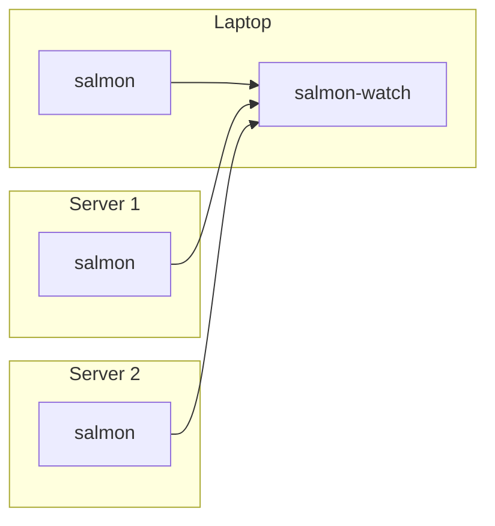

# Show HN: Salmon – tray and desktop alerts for systemd services and custom checks

> [!info] 一句话导读
> A tray icon and desktop alerts for failing systemd services and anything else

> [!meta]- 语料信息（点开展开）
> 来源：HN Show HN（post）
> 原帖：<https://news.ycombinator.com/item?id=49723631>
> 指标：点赞=2 · 评论=0 · engagement_velocity=2
> 作者：dimonomid　|　发布：2026-09-16T08:37:43Z
> 项目链接：<https://github.com/dimonomid/salmon>
> 采集：2026-09-20T09:37:05+08:00　|　id：`596fe69fad14cb7e`

## 正文

# dimonomid/salmon

A tray icon and desktop alerts for failing systemd services and anything else

- Stars: 18
- Forks: 1
- Watchers: 18
- Open issues: 1
- License: BSD 2-Clause "Simplified" License
- Default branch: master
- Created: 2026-08-23T09:18:50Z

## Languages

- CSS
- Go
- Go Template
- HTML
- JavaScript
- Makefile
- Rust
- Shell
- Slint

## Topics

- monitoring
- systemd
- tray
- tray-app
- tray-application
- tray-icon

## Top Contributors

- dimonomid (232 contributions)
- github-actions[bot] (4 contributions)

---

## README

# Salmon: a tray icon and desktop alerts for failing systemd services and anything else

Salmon is a simple monitoring utility which checks the health of your local
Linux machine and/or remote server(s), and helps you notice timely if something
is wrong.

Salmon demo

## Project history and naming

I use Syncthing to sync important data across multiple
machines. It works so well so after I've set it up, after some time I obviously
just got used to it working all the time. And then one day I noticed that
apparently some stuff didn't get synced. So I checked around, and found out that
the Syncthing systemd service got broken a couple weeks ago for some reason,
without me noticing it, and so nothing was synced during this time. That was
really annoying: it means that the synced data on the machines that I use could
have get diverged if I changed it on both of them, and if it's binary data, then
merging the changes will likely be a challenge.

And what's even more annoying is that an incident like a systemd service failure
totally should have been communicated to me somehow, and yet I didn't know about
it until I noticed a side effect of this failure.

It wasn't the first time when I got frustrated about the OS being too silent
about failures like that (both locally and on the servers), and so after this
Syncthing incident, I finally resolved to implement a utility which would help
me notice systemd service failures, at least by showing a simple icon in tray,
just like a green/red dot.

So the first idea was to make it sort of "systemd monitoring". However, after a
short while I realized that I actually want to reuse the same tray icon for
monitoring things other than systemd services; a trivial example is to just
check if we're not running out of disk space. Most desktop environments do
perform this check for us, but when it comes to the servers, we're on our own;
and it happened to me multiple times in the past that a server runs out of disk
space and it takes a while to find that out and fix. So the next idea was, in
addition to monitoring systemd services health, to also support running some
arbitrary command periodically, and notify when the exit code is not what we
want. This way, we can implement "polling" of literally anything that can be
checked from the shell. This check is not as realtime as with systemd, since we
probably shouldn't poll things more frequently than once per minute, but for
things like checking disk space, it should be good enough.

Anyway, so then the name became something like "systemd et al monitoring".
Which, if I take some random letters out of it: "Systemd et AL MONitoring",
becomes "salmon".

## Overview

This project has two main parts:

 * `salmon`, a background service written in Go: runs on a machine, checks its
 health, and serves the current incidents via simple read-only WebSocket
 API;
 * `salmon-watch`, a desktop app written in Rust + Slint: connects to one or
 more `salmon`s, receives data from them, shows a tray icon, sends desktop
 notifications, and provides a native GUI.

So `salmon` is a server (which can run locally too), and `salmon-watch` is a
client which runs on e.g. a laptop. If we have a laptop and two servers, a
typical setup looks like this:



Salmon reports incidents, each of them has:

- A key, like `systemd.my-service` or `free-space.exec-result`
- A state: `warning` or `error`

These incidents are generated accordingly to the Salmon configuration. For details
on that, see Configuring Salmon.

Salmon-Watch combines these incidents. For each incident, it also prefixes the
keys with the ID for that particular Salmon like `my-server` (that you specify
in the Salmon-Watch config) so the key becomes like
`my-server.systemd.myservice`.

For details about Salmon-Watch configuration, see
Configuring Salmon-Watch.

If an incident happens and we want to just acknowledge it but worry about it
later, we can snooze it in the UI, so the icon stops being annoying but it'll
get unsnoozed again later.

The tray icon shows the worst current non-snoozed state:

 * Gray: the initial state isn't known yet;
 * Green: everything is OK;
 * Magenta blinking: Salmon-Watch itself has an internal connection or tunnel error;
 * Yellow blinking: at least one warning;
 * Red blinking: at least one error.

## Installation Quick Start (Linux)

### Monitoring local machine

The easiest way to install both `salmon` and `salmon-watch` to monitor local
machine health is as follows:

First, download the latest prebuilt binaries from GitHub,
like `salmon-x.y.z_linux_amd64.tar.gz` and `salmon-watch-x.y.z_linux_amd64.tar.gz`,
and unpack them. You'll get two binaries: `salmon` and `salmon-watch`.

Then:

```bash
# Set up the monitoring service and start it. This also installs salmon binary
# under /usr/local/bin when not already there.
sudo ./salmon setup

# Install the desktop application system-wide:
sudo install -m 755 salmon-watch /usr/local/bin/salmon-watch

# Let the desktop application create its default config, autostart entry,
# and application launcher:
salmon-watch setup

# Start the desktop application (Salmon is already running):
salmon-watch
```

You should now see a tray icon, and if you click on it, you'll see the UI. When
you reboot, it will start automatically.

### Monitoring remote machines

If you have e.g. a personal server which you also want to monitor using the
same interface on your desktop, then on each such remote machine follow the
same steps as above, but only for `salmon` (no need to install `salmon-watch`
on the servers).

Having `salmon` running on your server, we need to point our local
`salmon-watch` to it, which by default only listens on 127.0.0.1 (so we can't
reach it directly from a laptop).

Presumably you have ssh access to your server with public key authentication
(i.e. you can ssh there without a password), so the easiest way forward here is
to establish an ssh tunnel, and `salmon-watch` has a convenient support for it:
open the config file `~/.config/salmon-watch/salmon-watch.yml`, and add one
more entry to the `wsClient.servers` array, like that (adjusting at least your
server hostname and username). There is no `addr` in this entry: for a
structured SSH tunnel, salmon-watch automatically allocates an available port
on `127.0.0.1`. You may still set an explicit loopback `addr` with a port of
your choice when a fixed local forwarding port is useful.

```yaml
    - id: myserver # Arbitrary but unique ID for this server.
      tunnel:
        ssh:
          host: myserver.com  # TODO: your actual server hostname
          user: myuser        # TODO: your actual ssh user
          port: 22            # Change if using non-default ssh port
          remoteSalmonAddr: 127.0.0.1:41990
```

And restart `salmon-watch` (right-click on the tray icon -> "Restart and reload
configuration"). Open the UI and verify that the list of servers now includes
your newly added remote server as well.

SSH tunnel is not the only way to access remote servers; salmon also supports
TLS and bearer token authentication. For details, see docs on
Security.

## Configuration

The default config (which `sudo salmon setup` writes to `/etc/salmon.yml`) is
as follows: if any systemd service is failing, it's a warning (the tray icon
will be blinking yellow). If there's less than 100 MiB of free space in the
root partition, it's an error (the tray icon will be blinking red). Otherwise,
it's all good (the tray icon is green).

The config includes comments and examples, so take a look and experiment with
it; and also check the Configuring Salmon docs. For
instance, I like to explicitly list services I particularly care about, such as
Syncthing, and configure any state other than `active` as an error rather than
a warning. That includes services stopped manually - if it was manually stopped
for some reason, I want to be annoyed by the blinking icon until the service is
running again. And I have some more custom exec checks as well.

Don't forget to restart the salmon systemd service to apply the changes:

```sh
sudo systemctl restart salmon.service
```

## Non-Linux OS support

So far Salmon was only tested on Linux. Nevertheless, the client
(`salmon-watch`) should work on Windows and MacOS as well, so you can run it
there and monitor your remote Linux servers, but not so much the local machine.

Even `salmon` can technically run on non-Linux, but obviously the `systemd` is
irrelevant there, and then the only useful check there is `exec`: just polling
some script periodically, so we lose the out-of-the-box system-wide system
service monitoring, and thus the usefulness is limited. Would be cool to
implement systemd-like checks for Windows and MacOS, but I don't use these so
hard to test. PRs are welcome.

## Development

### Building

You need Go 1.26 and
Rust 1.92 or newer.

On Ubuntu, install the native dependencies used to build and run
`salmon-watch`:

```sh
sudo apt-get install -y gcc libfontconfig-dev libxkbcommon-x11-0
```

`gcc` compiles native Rust dependencies, `libfontconfig-dev` provides the
Fontconfig development files required by Slint's font stack, and
`libxkbcommon-x11-0` is loaded by Slint/winit when the application runs under
X11.

Having that, to build both `salmon` and `salmon-watch`:

```sh
make
```

To build only one of them:

```sh
make salmon
make salmon-watch
```

To install built binaries under `/usr/local/bin`:

```sh
sudo make install-salmon
sudo make install-salmon-watch
```

The legacy Go client (serving local web ui) is not part of the default build.
Building it with `make salmon-watch-legacy` additionally requires
`libgtk-3-dev` and `libayatana-appindicator3-dev` on Ubuntu.

### Running tests

The test suite uses the same Go and Rust build requirements described above.
It also requires a current Node.js LTS release for the
legacy client's JavaScript tests. Because `go test ./...` compiles the legacy
GTK client, its native dependencies are required on Ubuntu too:

```sh
sudo apt-get install -y libgtk-3-dev libayatana-appindicator3-dev
```

Then:

```sh
make test
```

To run only the `salmon-watch` Rust tests:

```sh
cargo test --manifest-path cmd/salmon-watch/Cargo.toml
```

Two native window-geometry tests are ignored by the regular suite because
they require a real X11 session and window manager. A headless environment
cannot accurately test window positioning, maximizing, hiding, and restoring.
Run them explicitly, as separate commands:

```sh
cargo test --manifest-path cmd/salmon-watch/Cargo.toml native_startup_restores_geometry_and_maximized_state -- --ignored
cargo test --manifest-path cmd/salmon-watch/Cargo.toml native_hide_show_preserves_normal_geometry_while_maximized -- --ignored
```

They must run separately because Slint's GUI platform can be initialized only
once per test process. Running both together would make the second test fail
for a platform-initialization reason rather than a geometry problem.

## Screenshots

Salmon Watch OK
Salmon Watch Warn1

## Documentation

- Configuring Salmon
- Configuring Salmon-Watch
- Security

# Nerdulator: Put something in. Get everything out.

## 导航

- 项目页：[[10-项目/github.com_cf61d04e]]
- 渠道页：[[50-渠道/hn_show]]
- 赛道：`开发者工具`（见 [[浏览]] 的「按赛道」视图）
- 同渠道/同赛道批量浏览：[[浏览]]
