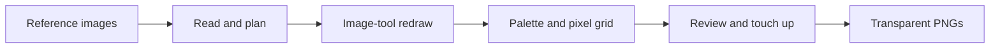

# Show HN: Picxel – Turn reference images into pixel-art game assets

> [!info] 一句话导读
> Turn reference images into pixel-art game assets，for indie game developers.

> [!meta]- 语料信息（点开展开）
> 来源：HN Show HN（post）
> 原帖：<https://news.ycombinator.com/item?id=49726346>
> 指标：点赞=8 · 评论=1 · engagement_velocity=8
> 作者：Goumang　|　发布：2026-09-16T13:02:02Z
> 项目链接：<https://github.com/See-Sol-Lab/Picxel>
> 采集：2026-09-20T14:04:20+08:00　|　id：`ebf41680435681bb`

## 正文

# See-Sol-Lab/Picxel

Turn reference images into pixel-art game assets，for indie game developers.

- Stars: 22
- Forks: 0
- Watchers: 22
- Open issues: 0
- License: GNU General Public License v3.0
- Default branch: main
- Created: 2026-09-12T14:08:52Z

## Languages

- HTML
- JavaScript
- Python

## Topics

- ai
- ai-tools
- design
- design-tool
- design-tools
- game
- game-development
- pixel
- pixel-art
- pixel-art-maker
- pixel-editor

## Top Contributors

- See-Sol-Lab (31 contributions)

---

## README

 Picxel

 English · 中文
 Turn reference images into pixel-art game assets.

Picxel helps indie game developers redraw references as recognizable game assets. GPT interprets the subject and directs the redraw; local algorithms turn the result into a precise pixel grid. Developed and tested primarily with GPT-6 Astra in Codex.

Export transparent **32×32, 64×64 or 128×128 PNGs**, with up to 16 colors per sprite. Use single-image reveal previews or batches of up to 20 images, in an English or Chinese panel.

## Demo

Picxel batch results: steak and wine glass at 128 and 64 pixels

**Watch the demo · 2:47** — From reference selection to transparent PNGs: a horse, followed by a two-image batch. Includes English subtitles and narration.

## From references to sprites

Choose your references in the panel:

Potion, cake and apple reference images in the English panel

Compare the redrawn concept with **128, 64 and 32 px** outputs, from left to right:

Potion and cake concepts alongside three pixel sizes in the English panel

Cake and apple concepts alongside 128, 64 and 32 px sprites

Open the local panel in your own browser, or ask Codex to start it and show it inside the Codex app. Follow progress and inspect results beside the conversation:

Codex conversation and the Picxel panel side by side

## Get started

You need a **Codex session with image-generation tools** and Python 3.10+. Picxel uses that session's tools and quota; it does not require a separate API key.

1. Ask Codex: **“Install Picxel from https://github.com/See-Sol-Lab/Picxel and follow its SKILL.md to complete setup.”** It should install the skill through the host's skill installer, prepare dependencies and show the panel.
2. Once installed, ask for your assets: **“Use $picxel to turn these references into game sprites.”** Picxel's first step is to prepare and open the panel automatically. You do not need a separate request to open it.
3. Choose images, an output folder and sizes; say **“Start with the panel settings.”** If you already supplied those choices in chat, the assistant can fill them in for you.

Click **Open finished images** to collect the concepts and PNGs. A batch uses one source folder; add images together or one at a time. Installing files alone does not run an idle assistant: setup or an asset request activates the workflow.

Already downloaded the repository? Open its folder in Codex and ask to create pixel-art assets; the project instructions route the assistant to the same workflow. If a newly installed skill is not listed, restart the Codex session. See Codex skill discovery.

## How it works

The skill coordinates the work. The image-processing code and targeted drawing rules improve specific stages:

| Stage | What Picxel improves |
|---|---|
| Before redrawing | A short keep/drop plan protects identity, pose and important details. Regional simplification reduces distracting texture when a preparation image is needed. |
| Background removal | Preserves real alpha. With an explicitly chosen key color, removes that background and narrowly cleans matching edge spill while protecting dark outlines. |
| Palette selection | Counts source colors at full resolution and compares perceived color differences in Oklab. Important regions get more weight; transparent pixels and uncertain edges get less. Selected colors come from the image. |
| Pixel conversion | Pads the visible silhouette and snaps colors before voting within each grid cell. Similar shades vote together; transparent coverage is counted separately, reducing broken shapes and color noise. |
| Local cleanup and faces | Merges close-colored specks while retaining high-contrast details. For complex faces, the assistant checks gaze and expression and applies constrained eye/mouth patches only when needed; eyebrows remain intact. |
| Efficient finishing | One concept and palette serve all requested sizes. Shared decoding and a combined review sheet reduce repeated work; only observed defects are repaired. |

Face interpretation is the assistant's visual judgment, not an automatic face detector. Grid alignment experiments are not enabled. You decide whether the final art fits your game.

Details: assistant workflow · technical specification · optional ComfyUI import/export nodes.

## Feedback and contributions

Issues and PRs are welcome. Include reproduction steps, target sizes and comparison images you can share publicly.

Project code is licensed under GPL-3.0-only. Generated images do not become GPL-covered merely because you use this tool; commercial use still depends on the rights to your inputs and the image provider's terms.

Copyright © 2026 See-Sol-Lab contributors.

# How Stale Is Your AI? - Live Model Freshness Tracker

## 评论（1/1）

> **kdeary1** · 2026-09-16T16:37:13.000Z　
> I've seen these types of tools a lot that all have the same pipeline: Use GenAI to create an image/find a source reference image -> use really basic algorithms to clean it up and align it to a grid + forcing a palette.The output of this one does look good for the examples you provided, but I cannot see myself ever using it.I don't really ever use these tools because they still can't stick to a single style for a game; Especially if you are using small enough sprite sizes like 16x16-32x32. Making one-off single frame assets is very simple and the itch.io assets page are flooded with them for free (AI generated and traditionally drawn).I'd like to see one of these tools generate a pixel art spritesheet for a character with a walk cycle or other animations based on a character concept and a base character. It would be very impressive to have a tool that can do that consistently.

## 导航

- 项目页：[[10-项目/github.com_306fc0a1]]
- 渠道页：[[50-渠道/hn_show]]
- 赛道：`AI 工具/Agent`（见 [[浏览]] 的「按赛道」视图）
- 同渠道/同赛道批量浏览：[[浏览]]
