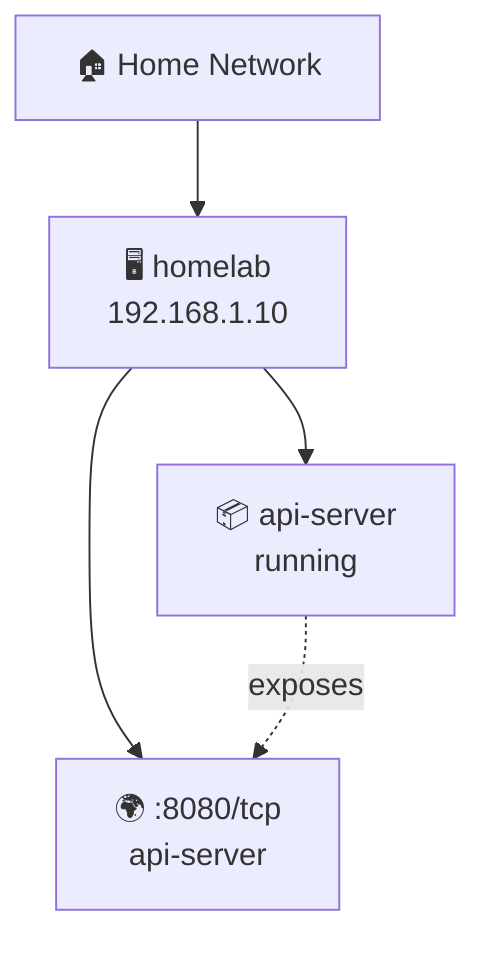

# Show HN: Homebutler – a single-binary homelab ops tool with backup drills

> [!info] 一句话导读
> Higangssh/homebutler

> [!meta]- 语料信息（点开展开）
> 来源：HN Show HN（post）
> 原帖：<https://news.ycombinator.com/item?id=47963114>
> 指标：点赞=3 · 评论=0 · engagement_velocity=3
> 作者：swq115　|　发布：2026-04-30T14:31:20Z
> 项目链接：<https://github.com/Higangssh/homebutler>
> 采集：2026-09-21T02:52:23+08:00　|　id：`7c8bda8842731617`

## 正文

# Higangssh/homebutler

🏠 Manage your homelab from chat. Single binary, zero dependencies.

- Stars: 248
- Forks: 16
- Watchers: 248
- Open issues: 12
- License: MIT License
- Homepage: https://homebutler.dev
- Default branch: main
- Created: 2026-02-23T09:17:24Z

## Languages

- CSS
- Dockerfile
- Go
- HTML
- JavaScript
- Makefile
- Shell
- Svelte

## Topics

- ai
- chatops
- cli
- devops
- docker
- go
- golang
- homelab
- mcp
- mcp-server
- monitoring
- openclaw
- raspberry-pi
- selfhosted
- ssh
- wake-on-lan

## Top Contributors

- Higangssh (285 contributions)
- lenny-ts (4 contributions)
- Deepak8858 (2 contributions)
- amanhalyal (1 contributions)
- KoAt-DEV (1 contributions)
- Zapi-web (1 contributions)
- fumkaa (1 contributions)

---

## README

 HomeButler

 Know what changed before you fix it.
 A single Go binary for running a small home server without babysitting it.

 Website ·
 Docs ·
 Releases

Section rules, labels, and severities are colour-coded in a terminal. Colour is
dropped automatically when output is piped, redirected, or run from cron.

That is the whole idea. Most homelab tools show you a graph of right now. HomeButler
remembers what your server looked like last time and tells you what moved.

HomeButler helps you answer the boring but painful questions every homelab eventually creates:

- What is running on my server right now?
- Which container owns this port?
- Why did this service restart at 3 AM?
- Is my backup actually restorable?
- Can I install this self-hosted app without hand-writing another compose file?
- Can I let an AI assistant inspect my server without handing it a full SSH shell?

No daemon required. No database. No always-on web service. Just one Go binary you can use from the terminal, scripts, a web dashboard, or AI tools.

The design goal is simple: give humans and agents a narrow, structured interface to the server. HomeButler returns readable summaries and JSON instead of asking you to trust a black-box shell session.

 ▶️ 34s demo — monitor, diagnose, and manage your homelab

## Quick Start

```bash
# One-line install (auto-detects OS/arch)
curl -fsSL https://raw.githubusercontent.com/Higangssh/homebutler/main/install.sh | sh

# Or via Homebrew
brew install Higangssh/homebutler/homebutler

# Interactive setup — add your servers in seconds
homebutler init
```

Use it right away:

```bash
homebutler status                    # CPU, memory, disk, uptime
homebutler docker list               # running containers
homebutler inventory scan            # containers + ports + topology
homebutler report                    # butler-style health report + change summary
homebutler install uptime-kuma       # deploy a self-hosted app
homebutler backup drill uptime-kuma  # verify a backup actually restores
homebutler watch tui                 # terminal dashboard
homebutler serve                     # web dashboard at http://localhost:8080
```

Machine-readable output is available everywhere:

```bash
homebutler status --json
homebutler inventory scan --json
homebutler report --json
```

## What it does

- **Install apps** — deploy Uptime Kuma, Jellyfin, Pi-hole, Gitea, Portainer, and more with one command
- **Map your server** — see containers, exposed ports, system ports, and service topology
- **Run a doctor check** — diagnose resource pressure, stopped containers, public ports, backup hygiene, notifications, and report baseline readiness
- **Catch crashes** — save logs before/after Docker, systemd, or PM2 restarts and detect flapping loops
- **Verify backups** — boot backups in isolated containers before you trust them
- **Use it anywhere** — CLI, JSON, web dashboard, or MCP for AI agents without giving them SSH

## Why homebutler?

Self-hosting is not hard because one `docker compose up` is hard. It is hard because the maintenance never ends: ports collide, containers restart silently, backups look fine until restore day, and every server becomes a slightly different snowflake.

HomeButler is a small operations toolkit for that messy middle.

### Why not just use Portainer, Netdata, or CasaOS?

Those are great dashboards. HomeButler is CLI-first, scriptable, JSON-friendly, air-gap friendly, and safe to copy onto any server. Use it when you want commands you can run from a terminal, cron job, SSH session, CI script, or AI agent — especially when you care more about “what changed?” than another graph.

## Core workflows

### 🧾 Butler Report

```bash
homebutler report
homebutler report --keep 7      # retain only the latest 7 snapshots
homebutler report --no-save     # preview without writing a snapshot
```

`report` gives you a concise butler-style summary of your homelab: current health, warnings, notable changes since the previous snapshot, and suggested next commands. On the first run, HomeButler creates a baseline under `~/.homebutler/reports/snapshots/`; later runs compare against the latest snapshot. Old snapshots are pruned automatically (`--keep 30` by default) so reports do not grow forever.

### 🩺 Doctor Check

```bash
homebutler doctor
homebutler doctor --strict          # non-zero exit if warnings/failures are found
homebutler doctor --json            # automation / MCP friendly
```

`doctor` is a read-only preflight for the problems homelab users usually discover too late: high disk or memory usage, stopped containers, public bind ports, stale or missing backups, missing notifications, and whether `report` has a baseline for change detection. Every finding names the next command to run, so `--strict` makes it usable from cron or CI.

### 🗂 Config Validation

```bash
homebutler config validate
homebutler config validate --strict   # exit non-zero on warnings too
homebutler config validate --json
```

`config validate` reads your config without starting anything and tells you
which file was used, which of the four resolution rules picked it, and what
homebutler actually made of each section. It exists because the two ways config
goes wrong are both silent: a key homebutler does not recognise is dropped
without a word, and a `--config` path that does not exist falls back to
built-in defaults rather than failing.

```text
Sections
   ✓ servers     2 servers (homelab, nas)
   · notify      not set
   ✓ alerts      cpu 95% · memory 85% · disk 90%

Findings
   ⚠️ Line 5: field notifiy not found in the homebutler config
      → Did you mean "notify"? Unrecognised keys are ignored silently.
```

### 📦 One-Command App Install

> **`homebutler install uptime-kuma`** — Deploy self-hosted apps in seconds. Pre-checks Docker, ports, and duplicates. Generates `docker-compose.yml` automatically. See all available apps →

### 🗺️ Inventory & Topology

```bash
homebutler inventory scan
homebutler inventory show --filter exposed
homebutler inventory export --format mermaid
homebutler --json inventory scan
```

`inventory scan` gives you a quick map of what is running on a server: system health, Docker containers, app ports, and system ports. Docker-published ports are connected back to the container that owns them, so local forwarding details like Colima/Lima stay understandable.

```text
🏠 Home Network
   Server  homelab (192.168.1.10)
   Summary ✅ 1 running · ⚪ 1 stopped · 🌍 2 public ports · 🔒 4 local ports

📦 Containers (2)
   ├─ ⚪ vaultwarden · not started
   │  └─ image vaultwarden/server:latest
   └─ ✅ api-server · running
      ├─ image my-api:latest
      └─ exposes :8080 → 8080/tcp

🌐 App Ports (1)
   └─ 🌍 :8080/tcp · api-server
```

To answer "what is reachable from outside my machine/network?" without reading the whole tree, filter the scan to exposed ports only:

```bash
homebutler inventory scan --filter exposed
```

```text
🏠 Home Network
   Server  homelab

🌐 Exposed Ports
   ├─ :8080/tcp · api-server
   └─ :8443/tcp · dashboard
```

Only ports listening on all interfaces (`0.0.0.0`, `::`, `*`) are shown. Anything bound to a specific address is hidden, including loopback and LAN addresses. Unsupported filter values return an error, as does combining `--filter` with `--json`; the default `inventory scan` output is unchanged.

Use Mermaid export when you want a diagram for GitHub, Obsidian, docs, or an AI assistant:



## Demo

### 🌐 Web Dashboard

> **`homebutler serve`** — A real-time web dashboard embedded in the single binary via `go:embed`. Monitor all your servers, Docker containers, open ports, alerts, and Wake-on-LAN devices from any browser. Dark theme, auto-refresh every 5 seconds, fully responsive.

 ✨ Web Dashboard Highlights

- **Server Overview** — See all servers at a glance with color-coded status (green = online, red = offline)
- **System Metrics** — CPU, memory, disk usage with progress bars and color thresholds
- **Docker Containers** — Running/stopped status with friendly labels ("Running · 4d", "Stopped · 6h ago")
- **Top Processes** — Top processes sorted by CPU/memory with zombie detection
- **Resource Warnings** — Visual CPU, memory, and disk thresholds in the dashboard
- **Network Ports** — Open ports with process names and bind addresses
- **Wake-on-LAN** — One-click wake buttons for configured devices
- **Server Switching** — Dropdown to switch between local and remote servers
- **Zero dependencies** — No Node.js runtime needed. Frontend is compiled into the Go binary at build time

```bash
homebutler serve              # Start on port 8080
homebutler serve --port 3000  # Custom port
homebutler serve --demo       # Demo mode with realistic sample data
```

### 🔄 Process Restart Watch

Your container crashed at 3 AM — but **why?** `homebutler watch` catches it the moment it happens, saves the dying logs, figures out the cause, and tells you if it's happening over and over.

**Supported backends:** Docker (real-time event stream) · systemd (polling) · PM2 (polling)

#### Step 1: Add targets to watch

```bash
homebutler watch add nginx              # Interactive: choose Docker / systemd / PM2
homebutler watch add --kind docker nginx          # or specify directly
homebutler watch add --kind systemd nginx.service
homebutler watch add --kind pm2 my-api
homebutler watch list                   # See what you're watching
```

#### Step 2: Start monitoring

```bash
homebutler watch start                  # Foreground, Ctrl+C to stop
homebutler watch start --interval 10s   # Custom poll interval (default 30s)
```

When a crash is detected, you'll see:

```
[03:14:22] INCIDENT: nginx (incident nginx-20260410-031422.581-7a2124)
  Crash: OOM — process killed by SIGKILL (oom, confidence: high)
  ⚠ FLAPPING: acute (3 restarts in short window)
```

#### Step 3: Investigate

```bash
homebutler watch history                # List all incidents
homebutler watch show <incident-id>     # Full details
```

`watch show` output includes:
- **Pre-death logs** — what the process printed right before it died
- **Post-restart logs** — what happened after the restart
- **Crash analysis** — category (oom / panic / segfault / timeout / dependency / error), reason, confidence level, matched log patterns
- **Flapping status** — if the process is stuck in a crash loop

#### Crash Analysis

Every incident is automatically analyzed using exit codes and log patterns:

| Signal | Exit Code | Meaning |
|--------|-----------|---------|
| SIGKILL | 137 | OOM Killer or forced kill |
| SIGSEGV | 139 | Segmentation fault (memory corruption) |
| SIGTERM | 143 | Graceful shutdown request |
| — | 1 | Application error |
| — | 0 | Clean exit (may be intentional restart) |

Log patterns like `panic:`, `Out of memory`, `Connection refused`, `FATAL`, and `timeout` are matched automatically to help identify the root cause.

#### Flapping Detection

Detects when a process is stuck in a restart loop (e.g., crash → restart → crash again):

- **Acute** — 3+ restarts within 10 minutes (something is broken right now)
- **Chronic** — 5+ restarts within 24 hours (slow recurring issue)

Flapping incidents are tagged `[FLAPPING]` in history and highlighted in `watch show`.

#### Notifications (optional, off by default)

Notifications are disabled by default, which is useful for air-gapped or closed networks where everything runs locally.

A minimal example in `~/.config/homebutler/config.yaml`:

```yaml
notify:
  telegram:
    bot_token: "your-bot-token"
    chat_id: "your-chat-id"

watch:
  enabled: true
  notify_on: flapping
  cooldown: 5m
  flapping:
    short_window: 10m
    short_threshold: 3
    long_window: 24h
    long_threshold: 5
  retention:
    max_incidents: 200

alerts:
  cpu: 90
  memory: 85
  disk: 90
  rules:
    - name: cpu-spike
      metric: cpu
      threshold: 90
      action: notify

    - name: elsa-monitor-down
      metric: container
      kind: systemd          # docker (default) | systemd | pm2
      watch: [lh-elsa-monitor.service]
      action: restart
```

### Restarting things that are not containers

`action: restart` restarts Docker containers unless the rule says otherwise.
`kind: systemd` or `kind: pm2` points it at a service or a PM2 app instead.

The kind is written on the rule rather than looked up from the watch list, so
restarting a host service is something you asked for in the config. It also
means every rule written before `kind` existed keeps meaning exactly what it
meant.

Two things worth knowing before using it:

**`systemctl restart` needs root or a polkit rule.** Running homebutler
unprivileged, a systemd restart will be refused, reported as failed, and
warned about when `alerts --watch` starts rather than when the rule first
fires.

**A target that is flapping is not restarted.** Restarting something already
in a restart loop feeds the loop, and most systemd units carry
`Restart=always`, so homebutler restarting them fights systemd's own backoff.
The thresholds are the `watch.flapping` ones above, and the skip is reported
rather than counted as either success or failure. This applies to Docker
targets too.

Legacy `~/.homebutler/watch/config.json` is still read as a fallback for watch-specific settings, and legacy `alerts.yaml` notify/webhook provider settings are still accepted for older setups.

- `watch.enabled: true` — allow watch notifications
- `watch.notify_on: flapping` — notify only when repeated restart loops are detected
- `watch.notify_on: incident` — notify on every incident
- `watch.notify_on: all` — notify on both incidents and flapping
- `watch.notify_on: off` — disable watch notifications without removing provider config
- `watch.cooldown: 5m` — suppress duplicate notifications for the same event fingerprint during the cooldown window
- `watch.flapping` — optional advanced tuning for restart-loop detection
- `watch.retention.max_incidents: 200` — how many incidents to keep on disk, newest first. Each incident stores up to 100 captured log lines, so the directory grows fastest exactly when a service is restarting in a loop. Set `-1` to keep everything.

These settings can also be written under a `watch.notify:` block, which is the
canonical form:

```yaml
watch:
  notify:
    enabled: true
    notify_on: flapping
    cooldown: 5m
  flapping:
    short_window: 10m
```

Both spellings are read, so either layout works. If a file contains both, the
`notify:` block wins and `homebutler config validate` says so.

#### Manage targets

```bash
homebutler watch remove nginx           # Stop watching
homebutler watch check                  # One-shot check (no continuous monitoring)
```

### 🖥️ TUI Dashboard

> **`homebutler watch tui`** — A terminal-based dashboard powered by Bubble Tea. Monitors all configured servers with real-time updates, color-coded resource bars, and Docker container status. No browser needed.

### 🧠 AI-Powered Management (MCP)

> **Use natural language when you want automation.** MCP clients can call homebutler tools to check server status, list Docker containers, inspect ports, or run operational workflows. See screenshots & setup →

## App Install

Deploy self-hosted apps with a single command. Each app runs via **docker compose** with automatic pre-checks, health verification, and clean lifecycle management.

```bash
# List available apps
homebutler install list

# Install (default port)
homebutler install uptime-kuma

# Install with custom port
homebutler install uptime-kuma --port 8080

# Install jellyfin with media directory
homebutler install jellyfin --media /mnt/movies

# Check status
homebutler install status uptime-kuma

# Stop (data preserved)
homebutler install uninstall uptime-kuma

# Stop + delete everything
homebutler install purge uptime-kuma
```

### How it works

```
~/.homebutler/apps/
  └── uptime-kuma/
       ├── docker-compose.yml   ← auto-generated, editable
       └── data/                ← persistent data (bind mount)
```

- **Pre-checks** — Verifies docker is installed/running, port is available, no duplicate containers
- **Compose-based** — Each app gets its own `docker-compose.yml` you can inspect and customize
- **Data safety** — `uninstall` stops containers but keeps your data; `purge` removes everything
- **Cross-platform** — Auto-detects docker socket (default, colima, podman)

### Available apps

| App | Default Port | Description | Notes |
|-----|-------------|-------------|-------|
| `uptime-kuma` | 3001 | Self-hosted monitoring tool | |
| `plex` | 32400 | Plex Media Server | `--media /path` to mount media dir |
| `vaultwarden` | 8080 | Bitwarden-compatible password manager | |
| `filebrowser` | 8081 | Web-based file manager | |
| `it-tools` | 8082 | Developer utilities (JSON, Base64, Hash, etc.) | |
| `gitea` | 3002 | Lightweight self-hosted Git service | |
| `jellyfin` | 8096 | Media system (movies, TV, music) | `--media /path` to mount media dir |
| `homepage` | 3010 | Modern homelab dashboard | |
| `stirling-pdf` | 8083 | All-in-one PDF tool (merge, split, convert, OCR) | |
| `speedtest-tracker` | 8084 | Internet speed test with historical graphs | |
| `mealie` | 9925 | Recipe manager and meal planner | |
| `pi-hole` | 8088 | DNS ad blocking | ⚠️ Uses port 53 (DNS), NET_ADMIN capability |
| `adguard-home` | 3000 | DNS ad blocker and privacy | ⚠️ Uses port 53 (DNS) |
| `portainer` | 9443 | Docker management GUI | ⚠️ Mounts Docker socket (HTTPS) |
| `nginx-proxy-manager` | 81 | Reverse proxy with SSL and web UI | ⚠️ Uses ports 80/443 |

### App-specific options

```bash
# Jellyfin: mount your media library
homebutler install jellyfin --media /mnt/movies

# Pi-hole / AdGuard: DNS ad blocking (port 53 required)
homebutler install pi-hole
# ⚠️ If port 53 is in use (Linux): sudo systemctl disable --now systemd-resolved

# Portainer: Docker GUI (mounts docker socket)
homebutler install portainer
# Access via HTTPS: https://localhost:9443

# Nginx Proxy Manager: reverse proxy
homebutler install nginx-proxy-manager
# Default login: admin@example.com / changeme (change immediately!)

# Any app: custom port
homebutler install <app> --port 9999
```

### Safety checks

- **Port conflict detection** — Checks if the port is already in use before install
- **DNS mutual exclusion** — Warns if pi-hole and adguard-home are both installed
- **Docker socket warning** — Alerts when an app requires Docker socket access (portainer)
- **OS-specific guidance** — Linux gets systemd-resolved fix, macOS gets lsof command
- **Post-install tips** — DNS setup, HTTPS access, default credential warnings

> Want more apps? Open an issue or see Contributing.

## Usage

```
homebutler <command> [flags]

Commands:
  status              System status (CPU, memory, disk, uptime)
  doctor              Diagnose health, exposure, backups, and readiness
  config validate     Check the config file and report what is ignored
  docker list         List running containers
  install <app>       Install a self-hosted app (docker compose)
  alerts              Show current alert status
  watch tui           TUI dashboard (monitors all configured servers)
  watch add/list/remove  Manage watched containers
  watch check/start   One-shot or continuous restart detection
  watch history/show  Browse restart history
  serve               Web dashboard (browser-based, go:embed)

Flags:
  --json              JSON output (default: human-readable)
  --server <name>     Run on a specific remote server
  --all               Run on all configured servers in parallel
  --port <number>     Port for serve command (default: 8080)
  --config <path>     Config file (auto-detected, see Configuration)
```

Run `homebutler --help` for all commands.

 📋 All Commands & Flags

```
Commands:
  init                Interactive setup wizard
  config validate     Check the config file and report what is ignored
  status              System status (CPU, memory, disk, uptime)
  doctor              Diagnose health, exposure, backups, and readiness
  watch tui           TUI dashboard (monitors all configured servers)
  watch add <name>    Add container to restart watch list
  watch list          Show watched containers
  watch remove <name> Remove container from watch list
  watch check         One-shot restart check
  watch start         Continuous restart monitoring loop
  watch history       List restart history (alias: incidents)
  watch show <id>     Show restart details with logs
  serve               Web dashboard (browser-based, go:embed)
  docker list         List running containers
  docker restart <n>  Restart a container
  docker stop <n>     Stop a container
  docker logs <n>     Show container logs
  wake <name>         Send Wake-on-LAN packet
  ports               List open ports with process info
  ps                  Show top processes (alias: processes)
  ps --sort mem       Sort by memory instead of CPU
  ps --limit 20       Show top 20 (default: 10, 0 = all)
  network scan        Discover devices on LAN
  alerts              Show current alert status
  alerts --watch      Continuous monitoring with real-time alerts
  trust <server>      Register SSH host key (TOFU)
  backup              Backup Docker volumes, compose files, and env
  backup list         List existing backups
  backup drill <app>  Verify backup restores correctly (isolated)
  backup drill --all  Verify all apps in backup
  restore <archive>   Restore from a backup archive
  upgrade             Upgrade local + all remote servers to latest
  deploy              Install homebutler on remote servers
  install <app>       Install a self-hosted app (docker compose)
  install list        List available apps
  install status <a>  Check installed app status
  install uninstall   Stop app (keep data)
  install purge       Stop app + delete all data
  mcp                 Start MCP server (JSON-RPC over stdio)
  version             Print version

Flags:
  --json              JSON output (default: human-readable)
  --server <name>     Run on a specific remote server
  --all               Run on all configured servers in parallel
  --port <number>     Port for serve command (default: 8080)
  --demo              Run serve with realistic demo data
  --watch             Continuous monitoring mode (alerts command)
  --interval <dur>    Watch interval, e.g. 30s, 1m (default: 30s)
  --config <path>     Config file (auto-detected, see Configuration)
  --local             Upgrade only the local binary (skip remote servers)
  --local <path>      Use local binary for deploy (air-gapped)
  --service <name>    Target a specific Docker service (backup/restore)
  --to <path>         Custom backup destination directory
  --archive <path>    Specific backup archive for drill
  --all               Verify all supported apps (backup drill)
```

 🌐 Web Dashboard

`homebutler serve` starts an embedded web dashboard — no Node.js, no Docker, no extra dependencies.

```bash
homebutler serve                # http://localhost:8080
homebutler serve --port 3000    # custom port
homebutler serve --demo         # demo mode with sample data
```

📖 **Web dashboard details →**

## Backup & Restore

One-command Docker backup — volumes, compose files, and env variables.

```bash
homebutler backup                          # backup everything
homebutler backup --service jellyfin       # specific service
homebutler backup --to /mnt/nas/backups/   # custom destination
homebutler backup list                     # list backups
homebutler restore ./backup.tar.gz         # restore
```

> ⚠️ Database services should be paused before backup for data consistency.

📖 **Full backup documentation →** — how it works, archive structure, security notes.

### Alert Thresholds (Advanced)

`alerts` still exists for CPU, memory, and disk threshold checks, but it is an advanced flow and not the recommended first step for new users.

```bash
homebutler alerts --watch                  # default: 30s interval
homebutler alerts --watch --interval 10s   # check every 10 seconds
homebutler alerts history                  # view alert history
homebutler notify test                     # test your notification channels
```

Default thresholds: CPU 90%, Memory 85%, Disk 90%. Start with `watch`, then add `alerts` only if you specifically want threshold-based checks.

### 🔍 Backup Drill

**"Having a backup" and "being able to restore" are different things.**

Backup Drill boots your backup in an isolated Docker environment and verifies the app actually responds — like a fire drill for your data.

```bash
homebutler backup drill uptime-kuma        # verify one app
homebutler backup drill --all              # verify all apps
homebutler backup drill --json             # machine-readable output
homebutler backup drill --archive ./file   # use a specific backup
```

**What happens:**
1. Finds the latest backup archive
2. Verifies archive integrity (`tar` validation)
3. Creates an isolated Docker network + random port
4. Boots the app from backup data
5. Runs an HTTP health check
6. Reports pass/fail and cleans up everything

```
🔍 Backup Drill — uptime-kuma

  📦 Backup: ~/.homebutler/backups/backup_2026-04-04_1711.tar.gz
  📏 Size: 18.6 MB
  🔐 Integrity: ✅ tar valid (8 files)

  🚀 Boot: ✅ container started in 0s
  🌐 Health: ✅ HTTP 200 on port 58574
  ⏱️  Total: 2s

  ✅ DRILL PASSED
```

**Zero risk** — runs in a completely isolated environment. Your running services are never touched.

Supports health checks for: `nginx-proxy-manager`, `vaultwarden`, `uptime-kuma`, `pi-hole`, `gitea`, `jellyfin`, `plex`, `portainer`, `homepage`, `adguard-home`.

## Configuration

```bash
homebutler init    # interactive setup wizard
```

📖 **Configuration details →** — config file locations, watch/notify options, and advanced alert thresholds.

## Multi-server

Manage multiple servers from a single machine over SSH.

```bash
homebutler status --server rpi     # query specific server
homebutler status --all            # query all in parallel
homebutler deploy --server rpi     # install on remote server
homebutler upgrade                 # upgrade all servers
```

📖 **Multi-server setup →** — SSH auth, config examples, deploy & upgrade.

## MCP Server

Built-in MCP server — manage your homelab from any AI tool with natural language.

```json
{
  "mcpServers": {
    "homebutler": {
      "command": "npx",
      "args": ["-y", "homebutler@latest"]
    }
  }
}
```

Works with Claude Desktop, ChatGPT, Cursor, Windsurf, and any MCP client.

📖 **MCP server setup →** — supported clients, available tools, agent skills.

## Installation

### Homebrew (Recommended)

```bash
brew install Higangssh/homebutler/homebutler
```

Automatically installs to PATH. Works on macOS and Linux.

### One-line Install

```bash
curl -fsSL https://raw.githubusercontent.com/Higangssh/homebutler/main/install.sh | sh
```

Auto-detects OS/architecture, downloads the latest release, and installs to PATH.

### npm (MCP server)

```bash
npm install -g homebutler
```

Downloads the Go binary automatically. Use `npx -y homebutler@latest` to run without installing globally.

### Go Install

```bash
go install github.com/Higangssh/homebutler@latest
```

### Build from Source

```bash
git clone https://github.com/Higangssh/homebutler.git
cd homebutler
make build
```

## Uninstall

```bash
rm $(which homebutler)           # Remove binary
rm -rf ~/.config/homebutler      # Remove config (optional)
```

## Architecture

> **Goal: Engineers manage servers from chat — not SSH.**
>
> Alert fires → AI diagnoses → AI fixes → you get a summary on your phone.

homebutler is the **tool layer** in an AI ChatOps stack. It doesn't care what's above it — use any chat platform, any AI agent, or just your terminal.

```
┌──────────────────────────────────────────────────┐
│  Layer 3 — Chat Interface                        │
│  Telegram · Slack · Discord · Terminal · Browser │
│  (Your choice — homebutler doesn't touch this)   │
└──────────────────────┬───────────────────────────┘
                       │
┌──────────────────────▼───────────────────────────┐
│  Layer 2 — AI Agent                              │
│  OpenClaw · LangChain · n8n · Claude Desktop     │
│  (Understands intent → calls the right tool)     │
└──────────────────────┬───────────────────────────┘
                       │  CLI exec or MCP (stdio)
┌──────────────────────▼───────────────────────────┐
│  Layer 1 — Tool (homebutler)       ← YOU ARE HERE │
│                                                   │
│  ┌─────────┐  ┌─────────┐  ┌─────────┐           │
│  │   CLI   │  │   MCP   │  │   Web   │           │
│  │ stdout  │  │  stdio  │  │  :8080  │           │
│  └────┬────┘  └────┬────┘  └────┬────┘           │
│       └────────────┼────────────┘                 │
│                    ▼                              │
│             internal/*                            │
│   system · docker · ports · network               │
│   wake · alerts · remote (SSH)                    │
└───────────────────────────────────────────────────┘
```

**Three interfaces, one core:**

| Interface | Transport | Use case |
|-----------|-----------|----------|
| **CLI** | Shell stdout/stderr | Terminal, scripts, AI agents via `exec` |
| **MCP** | JSON-RPC over stdio | Claude Desktop, ChatGPT, Cursor, any MCP client |
| **Web** | HTTP (`go:embed`) | Browser dashboard, on-demand with `homebutler serve` |

All three call the same `internal/` packages — no code duplication.

**homebutler is Layer 1.** Swap Layer 2 and 3 to fit your stack:

- **Terminal only** → `homebutler status` (no agent needed)
- **Claude Desktop** → MCP server, Claude calls tools directly
- **OpenClaw + Telegram** → Agent runs CLI commands from chat
- **Custom Python bot** → `subprocess.run(["homebutler", "status", "--json"])`
- **n8n / Dify** → Execute node calling homebutler CLI

**No ports opened by default.** CLI and MCP use stdin/stdout only. The web dashboard is opt-in (`homebutler serve`, binds `127.0.0.1`).

**Now:** CLI + MCP + Web dashboard — you ask, it answers.

**Goal:** Full AI ChatOps — infrastructure that manages itself.

## Contributing

Contributions welcome! Please open an issue first to discuss what you'd like to change.
CONTRIBUTING.md covers what homebutler accepts and what a new
target has to prove.

## Security

Found a vulnerability? Report it privately through
the Security tab
rather than a public issue. SECURITY.md covers what is in scope
and what to expect.

## License

MIT

## 关联链接

- http://localhost:8080
- https://github.com/Higangssh/homebutler.git
- https://homebutler.dev
- https://localhost:9443
- https://raw.githubusercontent.com/Higangssh/homebutler/main/install.sh

## 导航

- 项目页：[[10-项目/github.com_51340e71]]
- 渠道页：[[50-渠道/hn_show]]
- 赛道：`AI 工具/Agent`（见 [[浏览]] 的「按赛道」视图）
- 同渠道/同赛道批量浏览：[[浏览]]
