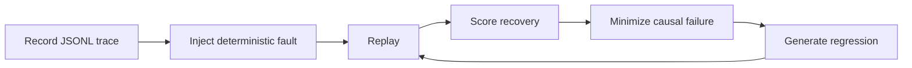

# Show HN: ResiliReplay - Chaos testing for AI agents and MCP servers

> [!info] 一句话导读
> aliengineering-byte/resilireplay

> [!meta]- 语料信息（点开展开）
> 来源：HN Show HN（post）
> 原帖：<https://news.ycombinator.com/item?id=49118105>
> 指标：点赞=3 · 评论=0 · engagement_velocity=3
> 作者：ali110v　|　发布：2026-07-31T01:44:29Z
> 项目链接：<https://github.com/aliengineering-byte/resilireplay>
> 采集：2026-09-21T03:11:11+08:00　|　id：`d0c7798e44aae63b`

## 正文

# aliengineering-byte/resilireplay

Crash-test AI agents and MCP servers, replay failures, and turn broken traces into deterministic regression tests.

- Stars: 0
- Forks: 0
- Watchers: 0
- Open issues: 8
- License: Apache License 2.0
- Default branch: main
- Created: 2026-07-30T22:40:13Z

## Languages

- JavaScript
- Python
- TypeScript

## Topics

- ai-agents
- chaos-engineering
- developer-tools
- fault-injection
- mcp
- model-context-protocol
- regression-testing
- reliability
- testing
- typescript

## Top Contributors

- aliengineering-byte (1 contributions)

---

## README

# ResiliReplay

CI
Secret scan
Release
License

**ResiliReplay crash-tests AI agents and MCP servers, replays failures deterministically, and converts broken traces into regression tests.**

It is a model-agnostic, local-first TypeScript toolkit: record versioned events, inject seed-controlled faults, score recovery from declared evidence, and compile the first causal failure into an editable scenario plus an executable Node test. The deterministic path needs no API key, paid model, Docker, external account, telemetry, or LLM judge.

ResiliReplay no-key deterministic demo

> ResiliReplay is defensive testing software. Audit only local or user-owned MCP targets. A report or badge is evidence for one declared suite and version, not a universal security certification.

## Five-minute quick start

Requirements: Node.js 20 or 22 and pnpm.

```console
git clone https://github.com/aliengineering-byte/resilireplay.git
cd resilireplay
pnpm install --frozen-lockfile
pnpm build
pnpm demo
```

The demo runs a real deterministic local subprocess, injects three faults, scores a successful recovery and an unrecovered failure, writes every report format, compiles the failed trace, and executes the generated regression test.

Continue the local tour:

```console
pnpm demo:mcp
pnpm exec resilireplay test scenarios
```

The MCP demo audits an intentionally vulnerable toy stdio server and a resilient one. The first has two expected safe-canary findings; the second has none. Open `runs/demo/recovered-report/report.html` in a browser to inspect the standalone recovery report.

See the demo guide and verified transcript for expected output and asset reproduction.

## Practical agent example

Record the bundled deterministic agent and emit a passing baseline report:

```console
pnpm exec resilireplay record --output runs/agent/trace.jsonl -- node examples/deterministic-agent/dist/index.js
pnpm exec resilireplay replay --trace runs/agent/trace.jsonl --report-dir runs/agent/report
```

Adapters for a real agent framework emit the same versioned `TraceEvent` objects. See the adapter guide; the OpenAI-compatible example is a translation fixture and does not claim to call a live provider.

## Practical MCP audit

Audit the bundled resilient server over stdio:

```console
pnpm exec resilireplay mcp audit --command "node examples/resilient-mcp-server/dist/index.js" --output runs/mcp-audit
```

`mcp audit` captures `tools/list` schemas and calls only a tool named `reliability_probe` by default. Pass `--call-tools` only after reviewing tool behavior, because MCP calls may have server-side effects. Non-loopback Streamable HTTP targets also require `--allow-remote`.

The MCP chaos guide covers controlled faults, transports, authorization, and safe-canary behavior.

## Fault injection

Apply a built-in fault or reviewable YAML scenario. The same trace plus scenario plus seed produces the same mutation:

```console
pnpm exec resilireplay inject --trace runs/agent/trace.jsonl --scenario malformed-json --seed 42 --output runs/agent/failed.jsonl
pnpm exec resilireplay replay --trace runs/agent/failed.jsonl --report-dir runs/agent/failed-report
pnpm exec resilireplay faults
```

The replay command above intentionally exits 1: the minimal baseline has no recovery event after the injected malformed response. It still writes the failed report bundle for review. Use `pnpm exec resilireplay test scenarios` when a CI command should verify both expected-pass and expected-failure scenarios with exit 0.

Provider and transport faults include bounded latency, timeout, 429/5xx, reset, truncation, malformed JSON, duplicates, and stale responses. Tool and workflow faults cover errors, permissions, disposable missing files, corrupt results, side-effect duplication, handoff loss, wrong recipients, stale state, conflicting instructions, and loops.

See custom fault scenarios for the YAML contract and safety rules.

## Trace to regression

`pnpm demo` creates a failed trace. Convert it into a minimized fixture, scenario, manifest, and executable `node:test`:

```console
pnpm exec resilireplay generate-test --trace runs/demo/failed.jsonl --output runs/generated-regression
```

The generated test executes immediately by default. `manifest.json` links the source trace, minimized fixture, scenario, and test with SHA-256 hashes.



## Sample recovery report

This excerpt is captured from the no-key demo:

```text
ResiliReplay v0.1.0  PASS
Recovery score  100/100
Completion      yes
Recovery        safe
Retries         1/3
Safety          compliant
```

Each run can emit:

| Format | File | Intended use |
| ----------- | ------------------- | ------------------------------- |
| Terminal | `terminal.txt` | Local and CI logs |
| JSON | `report.json` | Automation and dashboards |
| HTML | `report.html` | Standalone human review |
| JUnit | `junit.xml` | Test runners and CI annotations |
| SARIF 2.1.0 | `report.sarif` | Code-scanning ingestion |
| Manifest | `run-manifest.json` | Artifact and metrics hashes |
| SVG | `badge.svg` | Scope-limited run status |

See the report schema.

## Architecture

The stable boundary is a strict, provider-neutral `TraceEvent`, not a model SDK:

| Package | Responsibility |
| ----------------------------- | ------------------------------------------------------------------- |
| `@resilireplay/core` | Events, redaction, fault engine, deterministic scoring, path safety |
| `@resilireplay/trace` | Canonical JSONL and failed-trace-to-regression compiler |
| `@resilireplay/reporters` | Terminal, JSON, HTML, JUnit, SARIF, manifests, badges |
| `@resilireplay/mcp-chaos` | Authorized MCP discovery, calling, mutation, canaries, evidence |
| `@resilireplay/proxy` | Loopback provider/transport mutation proxy |
| `resilireplay` | Cross-platform CLI, recording, replay, scenarios, cleanup |
| `@resilireplay/github-action` | Repository-native CI integration |

Read the architecture for invariants and package dependencies.

## Security and privacy

- `record` executes the exact command you supply; it is not an OS sandbox.
- Audit only MCP servers you own or are authorized to test.
- Review MCP schemas before `--call-tools`; tools can have side effects.
- Omit secrets at the adapter source even though credential-shaped values and sensitive keys are redacted before trace storage.
- Treat reports as sensitive test evidence if source traces contain private application data.

Filesystem faults use owned temporary directories, output paths are containment-checked, spawned processes have deadlines and cleanup, and listeners bind to loopback unless a caller deliberately chooses another host.

Read SECURITY.md and THREAT_MODEL.md before running untrusted commands or remote MCP targets.

## Honest limitations

- Streamable HTTP support has less integration coverage than stdio.
- `record` is not an OS sandbox.
- MCP tool calls may have server-side effects.
- Causal minimization is strongest when adapters provide `parentId` and `causeId`.
- Streaming provider output is aggregated into response events in v0.1.0.
- Report hashes prove linkage and integrity, not authenticity; manifests are unsigned.
- Packages are not published to npm.

See known limitations and the roadmap.

## CI, release, and contributing

Run the complete local gate:

```console
pnpm quality
```

Use the composite action:

```yaml
- uses: aliengineering-byte/resilireplay@v0.1.0
  with:
    scenarios: scenarios
```

ResiliReplay is Apache-2.0 licensed. Contributions should be deterministic, bounded, and covered by tests. See CONTRIBUTING.md, CODE_OF_CONDUCT.md, the launch reference, release evidence, and the v0.1.0 release.

Built and maintained by **Ali**.

## 关联链接

- https://github.com/aliengineering-byte/resilireplay.git

## 导航

- 项目页：[[10-项目/github.com_bc47bf10]]
- 渠道页：[[50-渠道/hn_show]]
- 赛道：`AI 工具/Agent`（见 [[浏览]] 的「按赛道」视图）
- 同渠道/同赛道批量浏览：[[浏览]]
