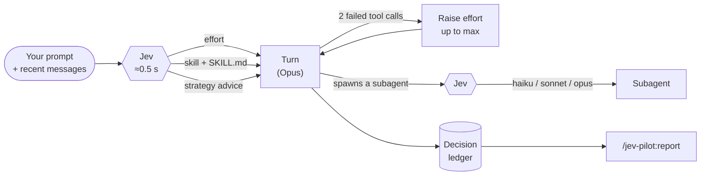

# Show HN: Jev-pilot – Jev picks Claude Code's effort, model and skill per prompt

> [!info] 一句话导读
> Akramovic1/jev-pilot

> [!meta]- 语料信息（点开展开）
> 来源：HN Show HN（post）
> 原帖：<https://news.ycombinator.com/item?id=49837537>
> 指标：点赞=2 · 评论=0 · engagement_velocity=2
> 作者：akramovic　|　发布：2026-09-24T22:21:49Z
> 项目链接：<https://github.com/Akramovic1/jev-pilot>
> 采集：2026-09-25T13:42:25+08:00　|　id：`267709b0a986e659`

## 正文

# Akramovic1/jev-pilot

Let Jev steer Claude Code: the right reasoning effort, subagent model and skill for every prompt. A Claude Code plugin powered by TypeSafe's Jev (OpenRouter / TypeSafe).

- Stars: 3
- Forks: 0
- Watchers: 3
- Open issues: 0
- License: Other
- Default branch: main
- Created: 2026-09-23T12:21:51Z

## Languages

- JavaScript
- Python
- Shell
- TypeScript

## Topics

- ai-agents
- claude-code
- claude-code-plugin
- jev
- llm-routing
- openrouter
- typesafe

## Top Contributors

- Akramovic1 (30 contributions)

---

## README

 The right reasoning effort, subagent model and skill for every prompt, decided by a model built for decisions.

 Install ·
 How it works ·
 The pet ·
 The crew ·
 Report ·
 Configuration ·
 Acknowledgements

---

**jev-pilot** is a Claude Code plugin. Before every turn, it asks Jev, TypeSafe's fast decision model, a few typed questions about your prompt and sets the turn up from the answers. You keep Opus for the conversation. Easy work runs at low effort and on cheaper subagents, and hard work gets the thinking it needs.

| | Decision | When |
|---|---|---|
| 🧠 | **Reasoning effort**, `low` → `xhigh` | at the start of each turn |
| 🚨 | **Raise effort, up to `max`**, when tool calls keep failing | mid-turn, at most once |
| 🤖 | **Subagent model and effort**: Haiku, Sonnet or Opus, `low` → `xhigh` | when a subagent starts |
| 🧭 | **Strategy**: do it directly, delegate, run in parallel, or plan a graph | at the start of each turn, as advice |
| 🧩 | **The one skill** the prompt needs, if any | at the start of each turn |
| 📊 | **A record of every decision**, with tuning suggestions | always, via `/jev-pilot:report` |

Jev never writes in your conversation. It talks through **Claude the pilot**, a small animated pet above the prompt that shows what Claude is doing and says what Jev decided.

 An illustrative session: the pet and its bubbles are drawn from the plugin's own code; the numbers are examples.

> [!NOTE]
> jev-pilot runs on Claude Code's **function hooks**, which are early access: they need Claude Code **2.1.278 or newer** and `CLAUDE_CODE_ENABLE_FUNCTION_HOOKS=1`. The `claude-jev` launcher sets that for you.

## 🚀 Install

```sh
curl -fsSL https://raw.githubusercontent.com/Akramovic1/jev-pilot/main/install.sh | bash
```

It asks for your OpenRouter key (create one here; Jev costs about $0.04 per million input tokens, with free output), installs jev-pilot as a regular Claude Code plugin, and adds the `claude-jev` command. Then start Claude Code with it:

```sh
claude-jev          # takes the same arguments as claude: claude-jev -c, claude-jev -p "…"
```

 What the installer does

1. Checks that Claude Code is installed and new enough.
2. Adds this repo as a Claude Code plugin marketplace and runs `claude plugin install jev-pilot@jev-pilot`. The key is passed with `--config`, so Claude Code keeps it in its own credential store, not in plain settings.
3. Links `claude-jev` into `~/.local/bin`. It's plain `claude` with function hooks on, plus the local router for custom models.

It changes nothing else. Re-running it updates jev-pilot and keeps your key. For scripted installs, set `JEV_OPENROUTER_KEY=sk-or-…` (or `JEV_SKIP_KEY=1`) to skip the prompt.

 Install by hand, with Claude Code's own commands

```sh
claude plugin marketplace add Akramovic1/jev-pilot
claude plugin install jev-pilot@jev-pilot --config openrouterApiKey=sk-or-v1-… --config timeoutMs=1500
CLAUDE_CODE_ENABLE_FUNCTION_HOOKS=1 claude
```

To skip typing the variable, put it in `~/.claude/settings.json` and plain `claude` will do:

```json
{ "env": { "CLAUDE_CODE_ENABLE_FUNCTION_HOOKS": "1" } }
```

 From a clone, for development

```sh
git clone https://github.com/Akramovic1/jev-pilot.git && cd jev-pilot
./install.sh
```

This loads the clone with `--plugin-dir`, so your edits take effect in the next session. Options go in `~/.claude/settings.json` under `pluginConfigs["jev-pilot"]`, and the installer adds your key there after a backup. `claude-jev` checks your clone's upstream once a day in the background and tells you when there's something new.

### Check it's working

Start `claude-jev` and look above the prompt, at the right: the pilot appears with a bubble saying `ready · openrouter`. After your first prompt the bubble says what Jev decided, such as `low · no skill · 99% sure`.

If it says `ready · no key, built-in`, the key isn't being read. Run the installer again. To see every step Jev takes, turn on `verboseLog` (see Configuration).

### Update and uninstall

```sh
claude-jev self-update                                            # update jev-pilot, whichever way it was installed
curl -fsSL https://raw.githubusercontent.com/Akramovic1/jev-pilot/main/install.sh | bash -s -- --uninstall
```

> [!IMPORTANT]
> If you ran `/jev-pilot:setup`, run `/jev-pilot:setup restore` before uninstalling. Otherwise your skills stay hidden from Claude with nothing left to load them.

## 🧠 How it works



**Effort.** Jev picks one of five levels, each described by the kind of task it's for, not an amount. Every question to Jev is a choice like this, each option saying when to choose it:

| Level | Kind of task |
|---|---|
| `low` | answered from what's known, or one mechanical step: a lookup, one command, a rename |
| `medium` | an ordinary, well-specified change to a few files, or a direct question about code in view |
| `high` | a change across several files, a described bug that must be traced, tests, a careful review |
| `xhigh` | design across components, a bug with an unknown cause, a refactor with many dependents |
| `max` | novel architecture, security or data integrity, a failure that resisted earlier attempts |

- **Close calls lean up, as far as `high`.** If Jev's two most likely levels are within `effortCloseMargin` (0.15), the higher one wins, because under-thinking costs more than over-thinking.
- **Above `high`, Jev has to be sure.** `xhigh` needs Jev at least 60% sure the task is very hard (`xhigh` and `max` together). A near split between hard and very hard stays at `high`.
- **Raising and lowering have different bars.** Raising effort needs confidence of 0.3 or more; lowering it needs 0.6.
- **Risky work gets real thought.** If carrying the task out would itself deploy, move money or destroy data, effort goes to at least `high`.
- **Turns start at `xhigh` at most** (`maxEffort`). Only the mid-turn raise reaches `max`: after `escalateAfterErrors` (2) failed tool calls in a row, effort goes up at least one level, once per turn. Permission denials don't count as failures.

**What Jev reads.**
- Your prompt.
- The last 4 messages, capped at 2000 characters: text and tool names only, never tool input or output. So "yes, do it" is judged as the work it agrees to.
- Plain facts about the request: its length, how many files it names, whether it contains code or an error, whether it's a question, and what recent turns did with their tools.

**Subagents.** Each one gets the cheapest model that can do its brief well: **Haiku** when there's no logic to work out (search, read and report, copy or clone, boilerplate, comments, renames, formatting, running a command), **Sonnet** when the logic is ordinary or already written down (carrying out a plan, a well-specified change, tests, a described bug), **Opus** when the work needs real judgment (design, unknown causes, security, migrations, production or money). Moving down a model needs Jev at least 60% sure. These are family names, so Claude Code uses its current release of each. No versions are hardcoded. It also gets an effort from the same decision, on the same rubric and bars as the main conversation, but Jev is asked how hard the brief is to *carry out*: a brief that already names the files, steps and tests has done the design, so builders and fixers usually get `high`, and `xhigh` is kept for briefs that ask for design or an unknown cause. The Agent tool has no effort setting, so jev-pilot sets it on each request the subagent makes.

**Claude knows it's there.** On the first prompt of each session (and after a compaction), Claude gets a short note listing what jev-pilot decides, so it leaves those decisions alone: it won't pin a subagent's model or effort, or make agent types just to fix one, unless you ask.

**Strategy.** The same request asks how to carry the work out:
- **`direct`**: the usual case, and nothing is attached.
- **`delegate`**: one subagent on a cheaper model does the broad, mechanical part.
- **`parallel`**: fan out, then join. Independent pieces that share no files run as simultaneous background subagents; the results are integrated and tested once.
- **`graph`**: for large builds only, a small blueprint of plain subagents. Real nodes (a step you could do inline isn't one), waves that start together, one shared plan file, a separate read-only reviewer after each join, and bounds (at most 4 subagents at a time, 2 review rounds per wave). If it can't be explained in one breath, Claude works directly.

Advice is attached only when Jev is confident (0.6, or 0.8 for `graph`) and it agrees with the tier. Claude may ignore it.

**Skills.** At most one per prompt. Jev reads every skill's description and the opening of its `SKILL.md`, next to a "none of these fits" option, and is asked to match the kind of work (debugging, planning, reviewing…), not a product the prompt happens to name. A skill for one platform (Vercel, Supabase, Firebase…) is picked only when the request, the conversation or the project uses that platform: jev-pilot reads what the project deploys with from its file names (`cdk.json`, `vercel.json`, `Dockerfile`…), so "deploy to production" in an AWS project doesn't get Vercel's deploy skill. A skill is picked when Jev is sure of it, or when the prompt needs a skill and it still fits. The winner's `SKILL.md` is added to the prompt.

**Better code, not just cheaper.** The same request also asks Jev what would make the work better. Jev can't judge code, since it never sees your repo, but it can judge the request. Each read acts only when Jev is sure:

| Jev reads the request as… | Claude gets | Bar |
|---|---|---|
| vague: "add caching", "make it better" | ask one short question, or state the assumption in one line, before coding | 85% |
| a bug: "it's off by one cent", "the test fails" | show the bug first with a failing test or a command, then fix it and show the same check passing | 80% |
| a costly area: money, auth, migrations, security | run the tests that cover it and add one for the changed case; if a reviewer (Codex or OpenCode) is working, get its review | 80% |
| your correction of the last turn: "it doesn't work", "not what I asked" | nothing: the last turn is marked in the ledger as corrected | 70% |

The questions were tuned on sample prompts. For example, a first wording rated "add a dark mode toggle" as vague as "add caching"; the final one separates them (0.19 against 0.86).

- **The corrections are the quality signal.** Until now jev-pilot only saw tool failures. `/jev-pilot:report` now shows, for each starting effort, how often you corrected the turn, and `/jev tune` leans up when cheap starts keep getting corrected. That's how you find out whether low effort is really enough for your work.
- **A turn going in circles.** When the same file is edited 4 times in a turn, or the same command fails a third time, Claude gets a note after that tool call (you don't see it): step back, read the error in full, say what's causing it, and try something else. The effort goes up a level, once. Before, only tool calls failing back to back raised it, and the edit, test, edit, test loop never does that.
- `/jev quality off` switches all of this off. It costs no extra wait: the questions ride in the same request.

**One request per prompt.** The effort, model, strategy and skill questions all go to Jev together, in one request of about 0.5 s. Before 0.6 there were three requests one after another: effort and strategy, the skill ranking, then a re-check of the top skills, about 1.5 s in all. On 16 test prompts the single request picked the same skill 14 times, and the other two picks were better. A plain "continue" asks nothing: the work goes on as the last turn decided. (Catalogs over the API's 255-choice limit are ranked in parallel batches, so it's still one wait.) `/jev-pilot:setup` can hide your own skills from Claude's skill list entirely (it asks first; `restore` undoes it).

## 🛩️ Meet the pilot

Claude the pilot, drawn as Claude Code's character, sits above the prompt at the right and shows what Claude is doing:

| Claude is… | The pilot | Its bubble |
|---|---|---|
| thinking | a thought cloud, `...` filling in | `⠋ thinking · …` |
| reading files or pages | an open book, the line being read lit up | `⠋ reading · …` |
| searching (Grep, Glob, web) | a magnifying glass, sweeping | `⠋ searching · …` |
| editing files or writing the answer | paper, a pencil writing lines | `⠋ writing · …` |
| running commands | a terminal, output scrolling | `⠋ running · …` |
| running subagents or other tools | flying: goggles down, jets on | `⠋ working · …` |
| idle | hovering and blinking; every few seconds it jumps rope, waves or looks around | Jev's last decision |

**The bubble** says the turn's effort, the skill attached (or `no skill`), any strategy advice, and **how sure Jev was of the effort**: `xhigh · /systematic-debugging · parallel · 88% sure`. When Jev wanted a change but wasn't sure enough to make it, it says so: `high kept · wanted low · 42% sure`. A mid-turn raise shows as `2 fails → max ✈`, and a subagent's model as `Explore → haiku`.

It draws only in the terminal (not in `claude -p`, the desktop app or mobile), and redraws only while something moves. `/jev pet off` hides it.

### Switch any part on or off

Everything is on by default except switching the main conversation's model. Type `/jev` to see the switches, and change them live:

```
/jev                    what is on
/jev skills off         one switch: effort · raise · subagents · skills · strategy · quality · model · pet
/jev all off            every switch (all on turns them back on)
/jev reset              back to your settings' defaults
```

Switches are remembered across sessions. `/jev skills off` leaves skills exactly as Claude Code handles them.

### How sure is Jev?

- **The bubble:** the `N% sure` at the end, for each turn.
- **A line per turn in the conversation:** set `display` to `both` or `transcript`, and each turn gets one line, such as `jev · low (93% sure) · no skill · 1.3s`.
- **Every raw score:** turn on `verboseLog` to see each answer with its confidence, such as `tier fast (0.99) · effort 0.0 → low (1.00) · risky 0.10 · strategy direct (1.00)` and `needs a skill 0.09`.

## 👥 The crew: custom models and other agents

jev-pilot can bring more workers into a Claude Code session than Claude alone:

- **Custom models:** any OpenRouter model you add, under a name you choose (up to 8). None is set until you add one.
- **Codex and OpenCode:** your own `codex` and `opencode` CLIs, with your own logins, as code reviewers. They run as themselves, not through OpenRouter.

**You choose how they're used** with a mode. Within that mode, Jev decides task by task.

| Mode | What happens |
|---|---|
| `standard` (default) | Claude only. Jev picks Haiku, Sonnet or Opus and the effort. |
| `budget` | Subagent work that needs no judgment (searching, reading and reporting, boilerplate) can go to a custom model, when Jev is sure. Opus keeps the judgment. |
| `junior-lead` | A junior on a custom model writes easy, well-specified code. Opus, as tech lead, reads its diff, runs the tests and sends it back once if something's wrong. You get a cheap implementation reviewed at Opus level. |
| `second-opinion` | After a significant change, Claude asks Codex (or OpenCode) for a review before calling the work done, then fixes what's right and says why it disagrees with the rest. |
| `quality` | Every subagent runs on Opus, plus the external review. |

Outside these modes you can still ask for a review at any time: *"have Codex review this"*. Claude then spawns `jev-pilot:codex-review`.

**Choose the reviewer's model.** Say it in your request, *"review this with Codex, Luna, high effort"*, or set a default that every session keeps:

```
/jev reviewer codex luna high          Codex reviews on Luna, high effort
/jev reviewer codex effort xhigh       just the effort
/jev reviewer opencode kimi-k3         an OpenCode model (checked against `opencode models`)
/jev reviewer codex default            back to the CLI's own config
```

A Codex tier name (`astra`, `sol`, `terra`, `luna`) always means the **newest** model of that tier. jev-pilot reads Codex's model list at every session start, so when a newer Luna ships, reviews move to it with nothing to change. A full id such as `gpt-5.6-luna` pins that exact version. Efforts are checked against what the model takes. `/jev status` shows what each reviewer runs on now, e.g. `luna (newest, now gpt-5.6-luna) · effort high`.

**Adding a model.** Pick a name, find a model on OpenRouter's list of models that can call tools, and paste it after the name. The id, the page link or the model's name all work:

```
/jev flash deepseek/deepseek-v4.1-flash
/jev coder https://openrouter.ai/qwen/qwen3-coder
/jev cheap DeepSeek: DeepSeek V4.1 Flash
```

jev-pilot looks the model up in OpenRouter's live list, adds it and says what it is: `coder is now qwen/qwen3-coder (Qwen: Qwen3 Coder 480B A35B · 262k context · $0.3 in · $1 out per million tokens)`. Then it checks the model answers.
- **Refused:** a model OpenRouter doesn't have gets the three closest ones to try, newest first. So does one that can't call tools, since Claude Code works through tools.
- **Names:** lowercase letters, digits and `-`, starting with a letter. Words `/jev` already uses (`status`, `mode`, `skills`…) can't be names.
- **Kept for every session:** the models are recorded in `~/.claude/jev-pilot/models.json`, which every session reads, in any project and whichever way jev-pilot is installed. A session that's already open takes up a change at its next prompt.

```
/jev <name> <model>                  add a model, or replace the one under that name
/jev <name>                          that model, and the models you added before (to switch back)
/jev remove <name>                   delete it, from every session and from /model (also: /jev <name> off)
/jev status                          the mode, your models, and a health check of every worker
/jev mode junior-lead                standard · budget · junior-lead · second-opinion · quality
/jev junior <name>                   which model the junior runs on (else the first you added)
/jev reviewer opencode               which agent reviews: codex or opencode
```

Changes apply from the next turn. The modes that use custom models (`budget`, `junior-lead`) say so when none is added yet.

**Workflows.** Agents a workflow script starts don't go through the Agent tool, so jev-pilot can't pick their model the way it does for subagents. Instead, the note Claude gets tells it to set each workflow agent's model in the script (`opts.model`): `haiku` for searching and reading, `sonnet` for ordinary well-specified work, and in `budget` mode your custom model for bulk work. Tested: in budget mode, both agents of a small reading workflow ran on DeepSeek, and the result was correct.

**Your models in `/model`.** Each model you add is a row in Claude Code's `/model` list, as ` · ` with its price, in `claude-jev` sessions (where the router is there to serve it). Pick it to run the whole conversation on it.
- **This session only:** press `s` on the row. Enter, or typing `/model jev- `, also makes it your default for new sessions, and plain `claude` sessions have no router to serve it. Where jev-pilot is loaded without the router (a marketplace install started as plain `claude`), it uses Sonnet instead and says so. A plain `claude` without jev-pilot just reports the model isn't found. `/model default` sets your default back.
- **New rows show from your next `claude-jev` session.** Claude Code reads the list when it starts. In the session where you added the model, `/model jev- ` works straight away.
- **It calls itself Claude.** Claude Code's system prompt tells every model it's Claude, so a custom model often says so. The router log (`~/.claude/jev-pilot/router.log`) shows which model really answered.

**Every worker is checked** when the session starts and on `/jev status`:

```
health:
  router     ✓  http://127.0.0.1:8799
  alpha      ✓  deepseek/deepseek-v4.1-flash · answering
  codex      ✓  Logged in using ChatGPT
  opencode   ✓  opencode 1.18.30 · GitHub Copilot, Fireworks AI, OpenAI…
```

A custom model has to answer a 1-token request, Codex has to be logged in, and OpenCode has to have a provider logged in. Workers that fail their check aren't used. A custom model not checked yet (the first prompt of a headless run) is used, since the router falls back to Claude if it fails. If the junior's model is down, the junior runs on Sonnet. If the chosen reviewer is down, the other one reviews, and if both are down, Claude says there was no external review.

 How custom models reach Claude Code

Claude Code talks to one server. `claude-jev` starts **jev-router**, a small local proxy on `127.0.0.1:8799` with no dependencies, and points Claude Code at it:

- A request for `jev- ` goes to the model you added under that name, on OpenRouter, which speaks the same Anthropic Messages format, tool calls included. It's sent with your OpenRouter key.
- Every other request streams through to Anthropic unchanged, headers and all, so your Claude login and plan work exactly as before. The OpenRouter key never goes to Anthropic, and your Claude login never goes to OpenRouter.

The router reads the slots from `~/.claude/jev-pilot/models.json`, which jev-pilot writes, so `/jev ` applies at once. It logs which slot went where (never the content) to `~/.claude/jev-pilot/router.log`. `claude-jev` also sets `ENABLE_TOOL_SEARCH=true`: without it, Claude Code sends every tool's schema with every request when it talks to a custom server.

**A custom model that fails never fails your work.** If OpenRouter is down or busy, the model is gone, or it doesn't start answering within 60 s, the router sends the same request to Anthropic as Sonnet, with the session's own login. It uses the Sonnet id it has seen in your own traffic and kept on disk, so no model version is written into it. `/jev status` shows each fallback and its reason. Only a failure after the answer has started streaming can't be taken back.

**Only your claude-jev sessions can use it.** Every request has to come under a secret path (`127.0.0.1:8799/ /…`). The secret is made once in `~/.claude/jev-pilot/router-secret`, readable by you alone, and `claude-jev` puts it in the address it gives Claude Code. Anything else gets a plain 404, and a request from a web page (a browser marks it with `Origin`) gets a 403. Without this, another program on your machine, or any web page open in your browser, could spend your OpenRouter credit through the router or stop it. `/jev status` shows the address without the secret.

**It stays up.** The router runs in its own session under a small supervisor. Closing the terminal that started it doesn't stop it, since other `claude-jev` sessions depend on it, and if it crashes it's back within a second. After an update, `claude-jev` replaces a router of an older version.

```
claude-jev router status     is it running, and what has fallen back
claude-jev router stop       stop it (the next claude-jev starts it again)
```

Open `claude-jev` sessions reach Claude through the router, so after a stop they need a restart.

`JEV_ROUTER=off claude-jev` starts without the router. Custom models are then off, and everything else works as before. `JEV_ROUTER_PORT` changes the port.

A reviewer is a small agent on Haiku with only Bash. It writes your brief to a temporary file and runs `codex exec -s read-only` (Codex's read-only sandbox) or `opencode run --agent plan` (OpenCode's read-only agent), then brings back the findings: P1/P2/P3, each with file:line and a fix, and a verdict. A review takes about half a minute to a few minutes.

## 📊 See if it's paying off

Every main-conversation turn is recorded: what Jev answered, the effort the turn started at, whether it was raised, tool calls, failures, how it ended, and output tokens. **No prompt text is ever stored.** After a few days, run `/jev-pilot:report` in a session:

```
Decision ledger: 142 turns since 2026-09-23.

Jev answered 97% of turns; latency median 540 ms, 90th percentile 910 ms.

| Started at | Turns | Raised mid-turn | Avg tool calls | Avg output tokens |
|---|---|---|---|---|
| low    | 61 | 3%  | 1.4  | 310  |
| medium | 38 | 8%  | 4.2  | 1180 |
| xhigh  | 29 | 17% | 11.6 | 5400 |
```
 Illustrative output: the format is exact, the numbers are made up.

After 20 or more turns, it suggests specific changes, such as a longer `timeoutMs` if answers arrive late, or leaning up more if cheap starts keep getting raised. It asks before editing anything. `/jev-pilot:report reset` clears the record.

**It learns from you.** You don't have to run the report. Every 20 turns jev-pilot reads the ledger itself, and when it points one way it says so in one line: `tune? minHighConfidence 0.5→0.6 · /jev tune`. For example, if your turns started at `high` keep finishing in two tool calls, high should take a surer answer. If turns started low keep getting raised, it should lean up. Nothing changes until you say so:

```
/jev tune          what's tuned, and what your last turns suggest
/jev tune apply    take the suggestion (on top of your settings, which stay as they are)
/jev tune reset    back to your settings
```

Each change needs 20 new turns of evidence before the next one, so the same turns never push twice.

**What this session came to.** `/jev` ends with a tally, and the bubble shows it every tenth turn:

```
this session: 24 turns · 11 started below your high effort, 2 above · 6 of 8 subagents on a cheaper model (4 haiku, 2 jev-alpha) · 310k tokens on them instead of the main model
```

These are counts, not dollars: prices differ by plan, and what a turn would have cost at another effort is something nobody saw.

**Measured.** jev-bench runs eight small coding tasks headless, with and without jev-pilot, and checks each result automatically. With 0.6.0 both setups passed all 8, and jev-pilot cost 13% less ($1.92 against $2.20). It was cheaper on 7 tasks and dearer on the one hard bug, where it chose to think more. The `junior-lead` mode passed its 4 coding tasks but cost a little more than jev-pilot alone: on tasks this small, the lead's review costs about what writing the code did.

## ⚙️ Configuration

Every option has a sensible default. On a marketplace install, change options with `/plugin configure jev-pilot@jev-pilot` in Claude Code. On a clone install, edit `pluginConfigs["jev-pilot"].options` in `~/.claude/settings.json`. The on/off options are also switches you can flip live with `/jev`.

 Most-used options

| Option | Default | What it does |
|---|---|---|
| `openrouterApiKey` / `typesafeApiKey` / `gatewayApiKey` | — | the backend key |
| `timeoutMs` | 1500 | how long to wait for Jev's one request before leaving a turn as Claude Code built it |
| `maxEffort` | `xhigh` | the highest effort a turn may start at |
| `maxRaisedEffort` | `max` | the highest effort the mid-turn raise may reach |
| `escalateAfterErrors` | 2 | failed tool calls in a row before a raise; 0 turns raising off |
| `effortCloseMargin` | 0.15 | how close two levels must be for the higher to win |
| `fastModel` / `balancedModel` / `deepModel` | `haiku` / `sonnet` / `opus` | subagent tiers: family names or full ids |
| `routeSubagentEffort` | true | also set each subagent's reasoning effort |
| `routeMainModel` | false | also switch the main conversation's model (invalidates the prompt cache); if Claude Code falls back to another model mid-turn (overload), the fallback stands |
| `suggestStrategy` | true | ask for and attach strategy advice |
| `graphSkill` | — | a heavier orchestration skill the `graph` advice may mention |
| `contextMessages` / `contextChars` | 4 / 2000 | how much of the conversation Jev reads; 0 sends none |
| `recordDecisions` | true | keep the decision record for `/jev-pilot:report` |
| `display` | `pet` | where jev-pilot talks: `pet`, `transcript` (one line per turn), `both`, or `off` |
| `verboseLog` | false | log every step: each answer with its confidence, the skill ranking, and why a turn was left alone |
| `suggestSkills` | true | pick one skill per prompt; off leaves skills as Claude Code handles them |
| `logDecisions` | true | master switch for jev-pilot's messages in the conversation (errors always show) |
| `mode` | `standard` | how the crew is used: `standard`, `budget`, `junior-lead`, `second-opinion`, `quality` |
| `alphaModel` / `betaModel` / `gammaModel` | not set | custom models named alpha, beta and gamma as settings (from before names were yours to choose); `/jev ` is easier and wins over these |
| ` When` | bulk work with nothing to judge | when Jev should choose the model you added as ` `, in plain words (e.g. `flashWhen`) |
| `junior` / `reviewer` | the first model you added / `codex` | the junior's model by name, and the external reviewer (`codex` or `opencode`) |

All options are listed, with descriptions, in `.claude-plugin/plugin.json`.

 Backends

| `provider` | Key option | Endpoint | Default model | Confidence |
|---|---|---|---|---|
| `typesafe` | `typesafeApiKey` | `POST api.typesafe.ai/v1/systemone` | `jev-latest` | calibrated |
| `openrouter` | `openrouterApiKey` | `POST openrouter.ai/api/v1/systemone` | `~typesafe/jev-latest` | calibrated |
| `gateway` | `gatewayApiKey` | `POST ai-gateway.vercel.sh/v4/ai/evaluation-model` | `typesafe-ai/jev` | only from an optional distribution |
| `builtin` | none | Claude Code's built-in classifier | n/a | none: tier only |

- **`auto`** (the default) uses the first backend in that order whose key is set.
- **Forced backends don't borrow keys.** A forced `provider` without its own key falls back to `builtin`; it never uses another backend's key.
- **To pin a Jev version,** set `openrouterModel` to e.g. `typesafe/jev-1.13`.

## 🔒 Cost, latency and privacy

- **Latency:** each prompt waits for one Jev request, typically about 0.5 s, capped at `timeoutMs`. If Jev doesn't answer in time, the turn runs exactly as Claude Code built it.
- **Cost:** Jev requests are small. The largest is the skill ranking, which sends every skill's description.
- **What leaves your machine** goes only to the backend you chose:
 - the prompt;
 - the recent messages' text and tool names;
 - skill names and descriptions, and the opening (300 characters) of each skill's `SKILL.md`.

 Tool input and output are never sent. `contextMessages: 0` sends no conversation.
- **The crew:** a custom model gets the subagent's whole conversation, through OpenRouter, like any model would. A reviewer runs the `codex` or `opencode` CLI on your machine, which reads your code and talks to its own provider with your own login. Neither happens in `standard` mode unless you ask for a review.
- **What a custom model is sent:** the conversation and the tools, as any model would get them. Claude Code also adds fields meant only for Anthropic: your account and device ids (`metadata`), your permission rules and project notes (`safeguards`), and context-management settings. The router removes those before a request goes to OpenRouter. If the request falls back to Claude, it goes to Anthropic unchanged.

## ⚖️ What it will and won't do

jev-pilot is a fast classifier in front of Claude, not a second brain. It sees your prompt and a few recent messages, never your code. At best, it matches effort and model to the task and supplies the right skill. It can still misjudge a hard task that reads as simple. The confidence bars, the lean toward more effort and the mid-turn raise limit the damage, and the report shows you how often it happens. Measure it on your own work before you rely on it.

## 🛠️ Development

```sh
bun test                                                   # unit tests of the decision logic   (tests/*.spec.ts)
CLAUDE_CODE_ENABLE_FUNCTION_HOOKS=1 claude plugin test .   # hooks in Claude Code's own engine  (engine/*.test.ts)
claude plugin validate .claude-plugin/plugin.json          # manifest and hook-registration rules
```

 Repository layout

```
.claude-plugin/plugin.json        manifest and options
.claude-plugin/marketplace.json   makes the repo installable with `claude plugin install`
install.sh                        the installer
bin/claude-jev                    launcher and self-update
hooks/jev-pilot.ts                the one hooks module: registers the rest
hooks/jev-model-router.ts         effort, subagent model, strategy, mid-turn raise, ledger
hooks/model-router.policy.ts        its pure decision logic
hooks/jev-skill-suggestion.ts     skill listing and the one-skill pick
hooks/skill-suggestion.policy.ts    its pure decision logic
hooks/context.ts                  what Jev reads of the conversation, and the request's signals
hooks/ledger.ts                   the decision record, the report and its suggestions
hooks/jev-pet.tsx                 the pet above the prompt, and the /jev command
hooks/pet-art.ts                  the pilot's pixel art: every pose, prop and frame, and the bubble's text
hooks/features.ts                 the switches /jev flips
hooks/summary.ts                  the one line per turn, for display transcript/both
commands/                         /jev-pilot:setup, /jev-pilot:report
docs/                             the original modules' documentation
assets/                           banner, demo and pet (animated SVG, CSS only), social preview card
scripts/assets/                   generate them: banner.py, demo.py, pet.py, social.py; the pet is
                                  drawn from hooks/pet-art.ts (frames.ts, petsvg.py)
```

The engine tests load the plugin without options, so they cover the keyless path. The keyed path is covered by the unit tests, and was checked live against OpenRouter.

 Releasing an update

Marketplace installs update by version number, so every release needs a version bump:

1. Bump `version` in **both** `.claude-plugin/plugin.json` and `.claude-plugin/marketplace.json` (CI checks they agree), and add a `CHANGELOG.md` entry.
2. Commit, then run `claude plugin tag .` to tag the release (`jev-pilot--v `).
3. Run `git push && git push --tags`.

Users then get it with `claude-jev self-update`, `claude plugin update jev-pilot@jev-pilot`, or by running the installer again. Clone installs update with `git pull` (or `claude-jev self-update`) and don't need a version bump.

## 🙏 Acknowledgements

jev-pilot is built on two open-source Claude Code mods by **Daniel (San) Ávila**, from claude-code-templates (MIT):

- **Jev Model Router**: aitmpl.com · source
- **Jev Skill Suggestion**: aitmpl.com · source

Their routing policy, the two-step skill suggestion and the setup command come from those mods, and their original docs are kept in `docs/`. jev-pilot merges them into one plugin and adds:
- the OpenRouter backend;
- the effort rubric up to `max`, with the close-call lean and the mid-turn raise;
- strategy advice;
- recent context and request signals;
- the decision ledger and report;
- batched skill ranking;
- the pet and the `/jev` switches;
- the installer and `claude-jev`.

Decisions are made by **Jev**, TypeSafe's System One model. The pilot in the banner and the pet is fan art of Claude Code's character. Claude and Claude Code are trademarks of Anthropic. jev-pilot is a community project, not affiliated with TypeSafe or Anthropic.

## 📄 License

MIT. Portions are copyright Daniel (San) Ávila, from claude-code-templates.

## 关联链接

- http://127.0.0.1:8799
- https://github.com/Akramovic1/jev-pilot.git
- https://openrouter.ai/qwen/qwen3-coder
- https://raw.githubusercontent.com/Akramovic1/jev-pilot/main/install.sh

## 导航

- 项目页：[[10-项目/github.com_6d6d6a75]]
- 渠道页：[[50-渠道/hn_show]]
- 赛道：`AI 工具/Agent`（见 [[浏览]] 的「按赛道」视图）
- 同渠道/同赛道批量浏览：[[浏览]]
