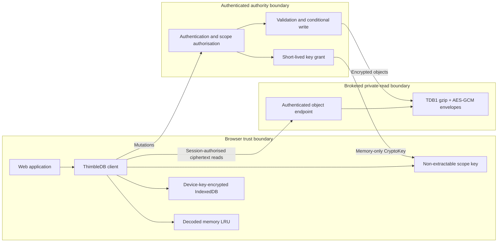
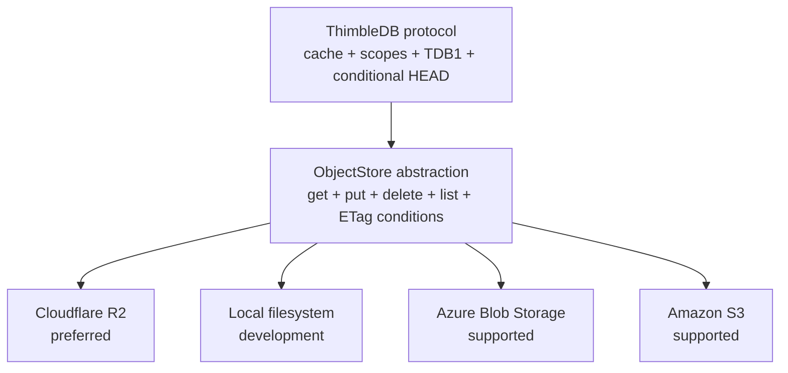

# Show HN: ThimbleDb, an encrypted lightweight low latency open source database

> [!info] 一句话导读
> Encrypted browser-first database for small web apps, backed by object storage with reusable Cloudflare and Node authorities

> [!meta]- 语料信息（点开展开）
> 来源：HN Show HN（post）
> 原帖：<https://news.ycombinator.com/item?id=49833722>
> 指标：点赞=2 · 评论=0 · engagement_velocity=2
> 作者：randomlurker2　|　发布：2026-09-24T17:12:18Z
> 项目链接：<https://github.com/Jason-Doyle/thimble>
> 采集：2026-09-25T13:42:25+08:00　|　id：`32baef94a1d3cb17`

## 正文

# Jason-Doyle/thimble

Encrypted browser-first database for small web apps, backed by object storage with reusable Cloudflare and Node authorities

- Stars: 1
- Forks: 0
- Watchers: 1
- Open issues: 0
- License: Apache License 2.0
- Homepage: https://thimbledb.com
- Default branch: main
- Created: 2026-09-23T17:29:11Z

## Languages

- Astro
- Bicep
- CSS
- Dockerfile
- HTML
- JavaScript
- TypeScript

## Topics

- aws-s3
- azure-blob-storage
- browser-database
- cloudflare-r2
- cloudflare-workers
- database
- encryption
- indexeddb
- object-storage
- oidc
- typescript
- webcrypto

## Top Contributors

- Jason-Doyle (34 contributions)

---

## README

 ThimbleDB

ThimbleDB is a Cloudflare-first database for small, read-heavy web
applications. Browsers read encrypted immutable objects through an
authenticated storage broker and retain them in memory and IndexedDB caches.
Writes and key grants use the same small authority.

Cloudflare Workers and R2 are the reference deployment. Azure Blob Storage,
Amazon S3, and a local filesystem adapter implement the same provider-neutral
ObjectStore contract.

Licensed under the Apache License 2.0.

## Architecture





The stored object and encryption protocol stays the same across providers.
Only bindings, credentials, and browser read authorisation differ.

## Features

- framework-free browser client
- memory and encrypted IndexedDB caches
- brokered immutable object reads
- ETag HEAD revalidation and offline fallback
- access-scope-separated collection trees
- adaptive gzip before AES-256-GCM
- object-key-bound authenticated encryption
- HMAC-derived private node addresses
- authority-only conditional writes with route and document ID validation
- Microsoft Entra and generic OIDC identity mapping
- opaque revocable sessions tied to stable internal user IDs
- dual-proof identity linking and provider-role administration
- per-user and per-tenant scope grants
- retained deletion, restoration, and quiescent physical collection
- immutable snapshot and content-addressed trie collection layouts
- typed collections, bounded predicates, and declared secondary indexes
- versioned logical archives and explicit migration adapters
- local application scaffolding and diagnostics
- optional package-owned Studio management frontend
- evidence-based layout recommendations and explicit migration
- write responses that update all open browser tabs
- Cloudflare Worker and native R2 binding
- local, Azure Blob, and S3 Node adapters
- historical key reads and an idempotent key-migration command
- Chromium, Firefox, and WebKit recovery tests
- typed package exports for the browser/core and auth APIs
- reusable Node and Cloudflare authority endpoint exports
- Docker, Wrangler, Bicep, and CloudFormation deployment paths

The reference browser build is about 58.6 KB uncompressed and 16.3 KB gzip.
It ships no database runtime or WASM module.

## Quick start

Create a local web app:

```powershell
npx thimbledb@latest create my-notes-app
cd my-notes-app
npm run dev
```

Or start from a maintained repository template:

- Node starter
- Cloudflare starter

Or install the package directly:

```powershell
npm install thimbledb
```

Generate the recommended Microsoft Entra delegated scope and application
roles:

```powershell
npx thimbledb generate-entra-roles --out entra-authorization.json
```

Enable the package-owned management frontend on a Node authority:

```ts
await startNodeAuthority({
  studio: true,
  studioOrigin: "https://database.example.com",
});
```

Then open `/studio/`. See ThimbleDB Studio.

The base install includes the browser/core APIs, authentication, Cloudflare
authority, local provider, and Node authority without cloud storage SDKs.
Install only the Node storage adapter your deployment uses:

```powershell
# Azure Blob
npm install @azure/storage-blob

# Amazon S3 or R2 through the S3 API
npm install @aws-sdk/client-s3
```

Use the browser/core API from `thimbledb`, external identity primitives from
`thimbledb/auth`, and the complete endpoint authority from either
`thimbledb/authority/node` or `thimbledb/authority/cloudflare`. Consumers
supply their own domain, storage, OIDC application, and secrets.

After the authority session exists:

```ts
import { createThimbleClient } from "thimbledb";

const db = await createThimbleClient();
const notes = db.collection<Note>("notes");
```

Follow the full quickstart for Cloudflare, Node, and
browser setup. Implementation prompts provide
copy-paste instructions for coding tools.

Use Should you use ThimbleDB for a vibe-coded app?
for an exact fit check before integration. The
database comparisons describe when D1, SQLite,
Firestore, lowdb, or direct object storage is the better choice.

See Use cases for workload fit checks and complete guides
for personal workspaces, tenant operations, field use, catalogues, journals,
and structured AI application context.

To run a source checkout:

```powershell
npm install
npm run dev
```

Open `http://127.0.0.1:5173`.

Configure Entra or a generic OIDC provider before signing in. The browser
harness accepts an API access token and exchanges it for a ThimbleDB session.
See Authentication.

The local provider is intended for development and one Node process. It is not
a multi-process coordination backend.

For the browser harness, sample store, and benchmark commands, see
Evaluation harness.

## Cloudflare reference deployment

The reference deployment uses:

- one Worker for API routes, static assets, scope authorisation, and key grants
- one R2 binding for writes and maintenance
- one authenticated Worker broker for encrypted browser reads
- the application's Entra or OIDC identity layer

Start with Deploy to Cloudflare.

## Performance characteristics

Published evidence includes live multi-region browser results against a
private Cloudflare Worker and R2 deployment:

- `evidence/r2-browser-multiregion-trie-2026-09-24.json`
- `evidence/r2-browser-multiregion-snapshot-2026-09-24.json`

The measurements show:

- full-content caching dominates repeated-read latency
- location-only caching greatly reduces trie point-read bytes
- a single mutable collection root performs poorly under bursty concurrent
 writes
- monolithic compressed snapshots remain credible for small, rarely changed
 collections
- moving the 128-document product catalogue from trie to snapshot reduced
 measured cold reads by 29-53 percent across three Azure regions
- a 10-second HEAD TTL reduced warm snapshot p95 to 1.6-8.3 ms in those runs
- cold reads and external session creation still miss the original latency
 targets and remain documented limitations

These results do not establish better cost or latency than D1, Durable Objects,
Turso, Firestore, or another managed database. See
Benchmarks for methods, raw artifacts, limitations, and
layout decision thresholds.

## Documentation

| Document | Purpose |
| --- | --- |
| Quickstart | Package, authority, browser client, and verification setup |
| Implementation prompts | Copy-paste integration, deployment, migration, and review prompts |
| npm publishing | OIDC trusted publisher setup and release process |
| Use cases | Fit criteria and application-specific guides |
| Architecture | Components, data flow, and scope model |
| System diagrams | Trust boundaries, sequences, keys, and providers |
| Storage providers | Provider abstraction and conformance requirements |
| Security | Threat model, encryption, keys, and revocation |
| Authentication | External identity mapping, sessions, and scope grants |
| Deletion and retention | Tombstones, restoration, scope erasure, and physical collection |
| Adaptive layouts | Snapshot/trie recommendations and explicit migration |
| Protocol | Binary envelope and object layout |
| Versioning | Package, protocol, key, and v1 compatibility rules |
| Public API | Stable package exports and authority integration |
| Evaluation harness | Browser harness, sample application, and benchmark usage |
| Benchmarks | R2 browser methodology, results, and limitations |
| Tradeoffs | Proven, expected, and unsuitable use cases |
| Cloudflare deployment | Worker and R2 reference deployment |
| Azure deployment | Container Apps and Blob Storage |
| AWS deployment | Lambda container and private S3 buckets |
| Operations | Keys, backup, metrics, incidents, and cleanup |

## When to use ThimbleDB

ThimbleDB is suited to small per-user or per-tenant datasets, catalogues,
configuration, internal tools, and applications whose hot working set fits in
browser storage.

Choose another database for relational transactions, high-frequency shared
counters, large cross-tenant queries, or strict immediate revocation. Warm
cached reads are fast, but cold object reads and external session creation can
take seconds from distant regions. Design the first-load experience with those
limits in mind.

# velvet-shark/timebar

## 关联链接

- http://127.0.0.1:5173`.
- https://database.example.com
- https://thimbledb.com

## 导航

- 项目页：[[10-项目/github.com_ff4d7256]]
- 渠道页：[[50-渠道/hn_show]]
- 赛道：`AI 工具/Agent`（见 [[浏览]] 的「按赛道」视图）
- 同渠道/同赛道批量浏览：[[浏览]]
