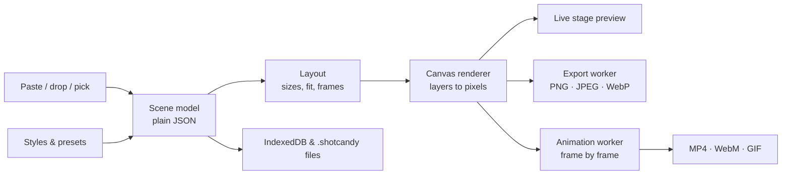

# Show HN: ShotCandy – Turn any screenshot into a beautiful share-ready image

> [!info] 一句话导读
> Turn any screenshot into a beautiful, share-ready image in seconds. Free, open source, runs entirely in your browser.

> [!meta]- 语料信息（点开展开）
> 来源：HN Show HN（post）
> 原帖：<https://news.ycombinator.com/item?id=49871097>
> 指标：点赞=2 · 评论=0 · engagement_velocity=2
> 作者：bilater　|　发布：2026-09-27T21:35:45Z
> 项目链接：<https://github.com/btahir/shotcandy>
> 采集：2026-09-28T09:47:28+08:00　|　id：`c483d0758a15b34f`

## 正文

# btahir/shotcandy

Turn any screenshot into a beautiful, share-ready image in seconds. Free, open source, runs entirely in your browser.

- Stars: 11
- Forks: 0
- Watchers: 11
- Open issues: 0
- License: MIT License
- Homepage: https://shotcandy.vercel.app
- Default branch: main
- Created: 2026-09-26T21:54:58Z

## Languages

- CSS
- HTML
- JavaScript
- TypeScript

## Top Contributors

- btahir (64 contributions)

---

## README

### Paste a screenshot. Get something lovely.

Shotcandy turns a plain screenshot into a share-ready image or video in seconds.
Free, open source, and it runs entirely in your browser. No account, no upload.

---

## Before and after

Every "after" below is a real export from Shotcandy's engine, one click from the plain screenshot on the left.

## Why Shotcandy

- **Instant.** Press ⌘ V. Your screenshot lands already styled, and every style thumbnail previews *your* image, not a sample.
- **Private.** Nothing leaves your browser. There is no server to upload to.
- **Free, for real.** No account, no paywall, no locked styles, no watermark. MIT licensed.
- **Made for sharing.** Exports are sized and compressed for the place you are posting, and they can move.

## Features

### Styles

36 one-click styles in seven families (from your shot, fruity, pastel, paper, deep, wallpaper and device). Hover to preview, press G for the whole Candy Jar, or press S for Candy Shuffle, which re-rolls background, tilt and frame together. Styles that suit your screenshot come first, and "From your shot" builds a palette from the image itself. Save your own tweaks as presets.

Backgrounds cover solid colours, linear, radial and mesh gradients with an editor, 12 original wallpapers and your own images. Layout controls have named stops for padding, corners and shadow, plus borders, an inset plate, 3D tilt and position.

### Caption card

Turn a landscape screenshot into a tall post in one step. Pick a 9:16 story, a 4:5 portrait or any tall size and Shotcandy adds a headline and subhead above your screenshot, set in the brand's display type with ink or white picked to suit the background. Click the text on the canvas to edit it in place.

### Frames

A macOS window, a browser (light or dark), and drawn phone, tablet and laptop frames. All vector, all drawn by us, no vendor artwork.

### Annotations

Text, arrows (straight or curved), highlight boxes and blur/pixelate for anything private. Annotations can stick to the screenshot or to the canvas, and every one is editable after the fact.

### Motion

Eight motion presets (zoom in, focus, scroll, 3D sweep, float, drift, draw on, flip in) that loop seamlessly. Export MP4, WebM or GIF at up to 4K, rendered frame by frame by the same engine that draws your stills.

### Code images

Paste code, pick one of 8 themes with a matching background, highlight lines and set a filename. Syntax highlighting by Shiki across 27 languages, with auto-detect.

### Post and testimonial cards

Type or paste a post or a quote and get a polished card: name, handle, avatar, stats or star rating, in light, cream, candy, dark or midnight. No third-party API involved.

### App Store sets

Build a 3 to 10 slide set with headlines at Apple's exact sizes (iPhone 6.9", 6.5", 6.3", 5.5" and iPad), restyle every slide at once, and export the whole set as a ZIP.

### Export by destination

Tell Shotcandy where the image is going (X, LinkedIn, Instagram, Product Hunt, a README, Slack and docs) and it picks the size, format and quality, then checks the file fits that platform's limit. Or choose any preset yourself: Open Graph 1200×630, X, LinkedIn, Instagram post and story, Product Hunt, App Store and free aspect ratios. PNG, JPEG or WebP at 1× to 4×, copy to the clipboard, or download with your own filename pattern.

### Keyboard shortcuts

Everything has a key. Press? in the app for the full sheet.

| Action | Keys |
| --- | --- |
| Paste a screenshot | ⌘ V |
| Copy the image | ⌘ C |
| Download / export options | ⌘ S / ⌘ ⇧ S |
| Candy Shuffle | S |
| Candy Jar (all styles) | G |
| Previous / next style | [] |
| Cycle frames / padding | F / P |
| Text, arrow, highlight, blur | T A R B |
| Play or pause motion | M |
| Size menu | K |

## Privacy

Shotcandy is a static site. Your screenshots are decoded, rendered and encoded on your own device, in your browser, and are never uploaded anywhere. There are no accounts, no analytics and no server-side code. Recent designs, presets and uploaded backgrounds are kept in your browser's IndexedDB, and you can export any design as a `.shotcandy` project file to back it up or move it to another machine. After the page loads, the only network requests are for fonts.

## Run it locally

You need Node 20.9 or newer and pnpm.

```bash
pnpm i && pnpm dev
```

Then open http://localhost:3000.

## Self-host

The production build is plain files. There is nothing to configure: no environment variables, no database, no API routes.

```bash
pnpm build        # writes a fully static site to out/
pnpm serve        # optional: preview out/ with the zero-dependency static server
```

Upload `out/` to any static host: GitHub Pages, Netlify, Vercel, Cloudflare Pages, an S3 bucket or a plain nginx folder. URLs use trailing slashes, so no rewrite rules are needed.

## How it works

The heart of Shotcandy is a small, deterministic rendering engine in `src/engine`, written in plain TypeScript with no React dependency. The same scene plus the same input always produces the same pixels, which is what makes previews, exports and animation frames agree exactly.



- **Scene model** (`engine/scene`): a JSON description of canvas, background, card, frame, annotations and optional animation. Undo, presets, project files and the UI all read and write it.
- **Layout and render** (`engine/layout`, `engine/render`, `engine/frames`): layers drawn onto an HTML canvas, including our own vector frames and shadows.
- **Export** (`engine/export`): renders off the main thread in a worker, with size presets, scale factors and per-destination size limits.
- **Animation** (`engine/animation`): motion presets are functions of time over the same scene, encoded with WebCodecs plus `mp4-muxer` / `webm-muxer`, or `gifenc` for GIFs.
- **Modes** (`engine/code`, `engine/post`, `engine/appstore`): code images, post cards and App Store sets build ordinary scenes, so they get every style, frame and export for free.
- **UI** (`src/components`, `src/state`): a Next.js static export with Tailwind. The editor store drives the engine; the engine never knows about React.

## Testing

```bash
pnpm test            # Vitest: engine unit tests and headless render tests
pnpm test:e2e        # Playwright: visual regression against committed baselines,
                     # export sizes, and app flows in Chromium, Firefox and WebKit
pnpm bench           # export performance (budget: a 4K export in under 1.5 s)
pnpm typecheck && pnpm lint
```

To see every style on every sample screenshot at once, render the contact sheet:

```bash
CONTACT=1 pnpm vitest run tests/render/contact-sheet.test.ts
```

## Contributing

Issues and pull requests are welcome.

- Keep the engine pure: no DOM or React imports in `src/engine`, and no clocks or unseeded randomness in anything that renders.
- Add tests alongside changes. Visual changes should update the Playwright baselines on purpose (`pnpm test:e2e:update`) and say so in the PR.
- Use the fictional samples in `brand/samples` for demos and tests. Please don't add real product screenshots, logos or vendor device art.
- Run `pnpm typecheck && pnpm lint && pnpm test` before opening a PR.

## Credits

- Fonts: Bricolage Grotesque, Figtree and Geist Mono, all under the SIL Open Font License 1.1, bundled via Fontsource.
- Shiki (MIT) for syntax highlighting.
- mp4-muxer and webm-muxer (MIT), gifenc (MIT), fflate (MIT) and idb (ISC).
- Built with Next.js, React and Tailwind CSS (all MIT).
- The logo, wallpapers, frames, sample screenshots and launch media are original work, released under this project's MIT license. The sample apps and people in them are made up.

## Support

Shotcandy is free and always will be. If it saves you time, you can support the project with a one-off tip or a small monthly contribution.

## License

MIT © 2026 Bilal Tahir

## 关联链接

- http://localhost:3000.
- https://shotcandy.vercel.app

## 导航

- 项目页：[[10-项目/github.com_ce64deb2]]
- 渠道页：[[50-渠道/hn_show]]
- 赛道：`开发者工具`（见 [[浏览]] 的「按赛道」视图）
- 同渠道/同赛道批量浏览：[[浏览]]
